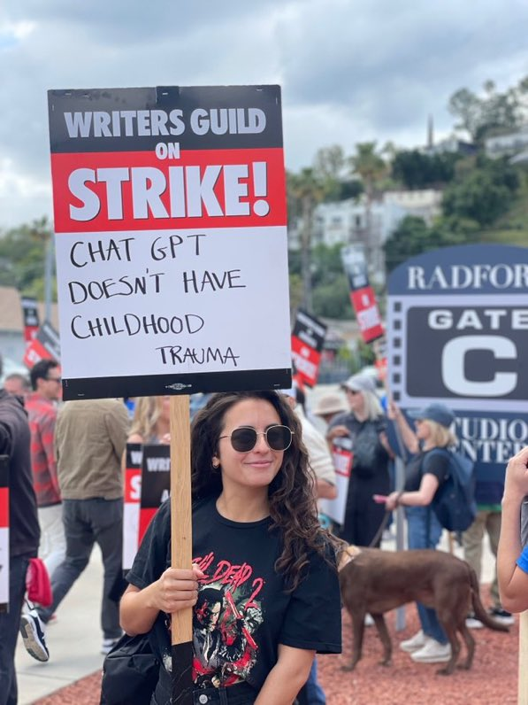
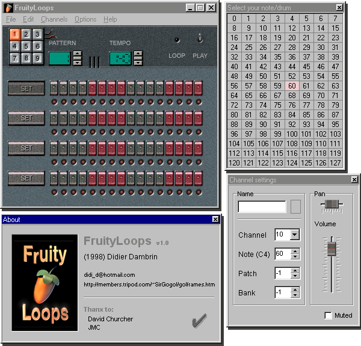
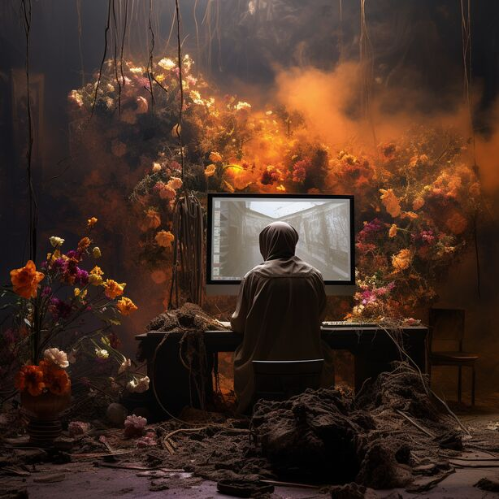

*La mort de l'art serait-elle imminente ? L’émergence d’IA génératives capables de créer textes, images ou sons à partir d’une simple requête a profondément choqué le monde de la culture. Pourtant, à rebours des récits alarmistes, ces outils pourraient en fait amorcer un mouvement radical de démocratisation de la production artistique... à condition d'empêcher l'industrie de se les approprier.*

-------------------

Publié sur : 

- [Le vent se lève](https://lvsl.fr/ia-generatives-mort-de-lart-ou-renouveau-de-la-culture/)
- [Une du club médiapart](https://blogs.mediapart.fr/sebastien-piquemal/blog/071123/ia-generatives-mort-de-l-art-ou-renouveau-de-la-culture)

-------------------

Vent de panique international dans le monde de la culture ! De nombreux artistes et organisations prennent publiquement position contre les intelligences artificielles dites “génératives” (abrégé GenIA), des nouvelles technologies qui permettent de composer textes, images ou audio grâce à une simple requête formulée en langage naturel1.

Certains craignent d’être mis de côté par les industries culturelles et de perdre leur emploi, remplacés par des machines. C’est notamment l’un des objets d’une grève exceptionnelle qui a bloqué pendant plusieurs mois l’industrie du cinéma américain. Deux importants syndicats, la SAG - AFTRA (guilde des acteurs) et la WGA (guilde des scénaristes) se sont battus pour obtenir des studios une plus grande sécurité de l’emploi face à la menace grandissante de l’IA qui pourrait, dans un futur très proche, écrire ou mettre en scène des acteurs fictifs pour une fraction du prix de leurs équivalents humains. Les grévistes ont reçu le soutien de nombreuses superstars hollywoodiennes, telles que Meryl Streep ou Leonardo DiCaprio2.

::: {style="display:flex;flex-direction:column;align-items:center;padding:1em 0;"}
</img>

“ChatGPT n'a pas de trauma d'enfance” - pancarte pendant la grève à Hollywood.” © Taylor

:::

D’autres critiques s’indignent de ce que l’activiste et écrivaine Naomi Klein qualifie du “vol le plus important de l’histoire de l’humanité”3 : l’utilisation par les entreprises d’IA de milliards d’œuvres, sans rétribution ni consentement de leurs auteurs. Les bots de ces entreprises arpentent Internet pour amasser images, textes, et tout ce qui leur tombe sous la main. Cette récolte est ensuite utilisée comme matière brute pour entraîner leurs applications de GenIA4, qui requièrent d’immenses quantités d’exemples afin de pouvoir apprendre à créer à leur tour.

Enfin, à en croire certaines prédictions aux accents de films post-apocalyptiques, on s’apprêterait à vivre la mort de l’art, le “grand remplacement” des artistes par les robots5, les GenIA seraient à la culture ce que Skynet dans le film Terminator est à l’humanité. “L’art est mort, mec. C’est fini. L’IA a gagné. Les humains ont perdu”6, déclarait en 2022 au New York Times l’artiste Jason Allen, l’un des premiers à avoir remporté un prix d’art avec une image générée par IA.

Comme souvent dans le capitalisme, nous nous retrouvons assujettis à un processus de mutation économique et sociale qui semble impossible à stopper, générant fantasmes, colère et confusion quant à la meilleure posture à adopter face au tsunami du changement.

Pourtant, le monde de la culture et ses industries ne sont pas étrangers aux bouleversements liés à l’introduction de nouvelles technologies. Un cas présentant justement des similitudes avec l’arrivée des GenIA est celui de l’introduction d’outils numériques dans la production musicale à partir des années 1980. Ce qu’il s’est alors joué entre les artistes, le public, l’industrie musicale et l’industrie de la tech pourrait préfigurer ce qu’il va se jouer dans un futur proche avec les GenIA.

Le précédent de l’industrie musicale
--------------------------------------

Avant les années 1980, produire un disque était cher et nécessitait un studio, un tas d’équipements conçus sur mesure et des ingénieurs du son pour faire tout fonctionner. À quelques exceptions près, seules de grandes multinationales surnommées les « majors » (EMI, Sony, Warner…) pouvaient prendre en charge de tels frais7. Ces entreprises étaient alors les gardiennes de la création musicale mondiale, et contrôlaient ce qui était produit, diffusé et distribué dans les magasins de disques, à la radio ou dans les clubs.

Entre les années 1980 et 2010, le numérique fit graduellement son entrée dans la conception d’équipements de production musicale, entraînant une baisse drastique du prix de réalisation des albums. Cette tendance connut son point d’orgue avec l’arrivée de logiciels appelés “Digital Audio Workstations” (DAW) qui incluent le studio d’enregistrement dans son entièreté, instruments de musique compris.

Un grand nombre de musiciens, amateurs et professionnels, se virent alors donner les moyens de produire des enregistrements de qualité depuis chez eux. Cette démocratisation de l’accès aux outils de production entraina une véritable révolution “do-it-yourself” (DIY) dans le monde de la musique8. Elle provoqua un boom de créativité collective et eut un impact culturel immense en permettant l’émergence de nouvelles formes comme le hip-hop et la musique électronique.

::: {style="display:flex;flex-direction:column;align-items:center;padding:1em 0;"}
</img>

 FruityLoops version 1.0, un DAW de première génération ayant acquis un statut culte auprès des producteurs de hip-hop. 

:::

Dans la foulée de ces mutations, l’industrie musicale fut déstabilisée pendant plusieurs décennies. Les studios d’enregistrement perdirent leur place privilégiée dans le processus de production des disques, ce qui causa une crise dans ce secteur ainsi qu’une dégradation des conditions de travail7. Finalement, l’industrie musicale réussit à se restructurer autour de nouveaux acteurs de la tech tels que les plateformes de streaming et les réseaux sociaux. Beaucoup des nouveaux genres et artistes qui avaient émergé de manière organique et contre-culturelle furent réabsorbés par le circuit commercial. Face à la saturation d’un marché du divertissement dans lequel il est difficile d’être audible, l’industrie musicale réussit à sauver sa position en se transformant en une machine à pub, optimisée pour faire des “vues” sur YouTube ou des “plays” sur Spotify.

Le fantasme de la mort de l’art
--------------------------------

Pour en revenir aux GenIA, la crainte qu’elles ne signeraient la mort de l’art est un fantasme. L’art est avant tout un acte de communication entre des êtres doués de conscience. Les systèmes de GenIA n’ont pas de libre arbitre, contrairement à ce que le mot “intelligence” dans leur nom suggère. Tout l’enjeu de la création avec une IA est justement pour l’artiste humain de parvenir à traduire son intention, afin que l’IA produise une œuvre qui s’en rapproche au maximum.

Le photographe Boris Eldagsen qui en 2023 a créé le scandale en remportant le prestigieux prix Sony World Photography Awards avec une image générée par IA décrit son travail ainsi : “[c’est] une interaction complexe […] qui puise dans la richesse de [mes] connaissances en photographie. […] [Travailler avec l’IA] ça n’est pas juste appuyer sur un bouton - et c’est fini. Il s’agit d’explorer la complexité du processus, en commençant par affiner des prompts, puis en développant un workflow complexe, et mélangeant des plateformes et des techniques variées. Plus vous créez un tel workflow et définissez des paramètres, plus votre apport créatif devient déterminant”9. Un journaliste du magazine WIRED, quant à lui, explique qu’il n’est “pas rare pour une image marquante de nécessiter 50 étapes”10.

::: {style="display:flex;flex-direction:column;align-items:center;padding:1em 0;"}
</img>

 “The Electrician”, photographie ayant remporté le Sony World Photography Awards. © Boris Eldagsen

:::

Pas la mort de l’art donc, mais il est possible que, de manière similaire à ce qu’il s’est produit pour l’industrie musicale, nous nous trouvions à l’aube d’une nouvelle révolution DIY qui affecterait cette fois-ci tous les champs de la création culturelle. Le fondateur de l’entreprise qui distribue le DAW FruityLoops explique le succès de ce logiciel par le fait qu’un utilisateur peut être “opérationnel en quelques secondes” et qu’il est “presque impossible de créer quelque chose qui ne sonne pas”11. De la même manière, les GenIA sont des outils d’une incroyable accessibilité. Elles permettent à n’importe qui de créer des œuvres d’art, sans avoir à posséder toute une infrastructure de production, sans avoir les compétences techniques pour l’opérer, sans même avoir de compétences artistiques. De plus, il suffit pour les utiliser de posséder un simple téléphone ou ordinateur12.

C’est justement dans les domaines artistiques qui requièrent des infrastructures de production très lourdes, avec des budgets énormes, comme le cinéma et le jeu vidéo, que le changement pourrait être le plus profond. Des startups imaginent déjà comment les GenIA pourraient radicalement démocratiser la production de films en automatisant certaines opérations très coûteuses, et en permettant de tester rapidement différents choix artistiques13. Ironiquement, les studios hollywoodiens auraient donc peut-être autant de raisons de craindre pour leur futur que les grévistes. En réduisant drastiquement le coût d’entrée dans l’industrie du cinéma, les GenIA pourraient permettre à de nombreux studios indépendants de se constituer. À terme, elles pourraient même permettre à des amateurs de produire des films entiers, avec acteurs, décors, mouvements de caméras et effets spéciaux, seuls et depuis leur chambre.

Le potentiel radical des GenIA
--------------------------------

Les GenIA, tout comme les DAW, représentent en réalité l’objectification d’une partie des compétences du monde de la culture, sous la forme de machines immatérielles qui peuvent produire plus rapidement, en quantité infinie et pour un coût bien moindre14. C’est une nouvelle occurrence de l’automatisation de la production industrielle, un phénomène ancien et intrinsèque au capitalisme qui a déjà touché de nombreux autres secteurs de l’économie. Marx dans le célèbre “Fragment sur les machines” décrivait en 1857 comment la quête incessante de productivité menait logiquement à la conception de machines qui intègrent le savoir-faire des travailleurs afin de déplacer ces derniers en périphérie du processus de production, remplaçant ainsi le travail par le capital.

À l’aune de la révolution du numérique, cette théorie a connu un regain d’intérêt grâce à des intellectuels comme Mark Fisher, Jeremy Rifkin, ou encore Paul Mason. Ces derniers postulent généralement que le chômage systémique et la surabondance des biens pourraient créer les conditions d’une émancipation du capitalisme, à condition de découpler le salaire du travail et de transformer les rapports de propriété15. Cette ligne de pensée, encore largement ignorée par la gauche contemporaine, avait d’ailleurs inspiré la campagne présidentielle, spectaculairement ratée, de Benoît Hamon avec le PS en 2017. Le candidat avait donné une position centrale aux enjeux de l’automatisation, et proposé d’y répondre avec des mesures comme le salaire universel ou la « taxe sur les robots ».

En appliquant cette théorie au domaine de la culture, on peut envisager que les GenIA soient en réalité porteuses d’un potentiel radical : celui d’extraire la production culturelle des relations d’échange capitalistes. La posture à adopter face à ces nouvelles technologies serait alors de prendre une part active dans leur développement, afin de s’assurer qu’elles deviennent un bien commun, et profitent ainsi à l’ensemble de la société et non aux seules industries.

C’est d’ailleurs le projet de fondations telles qu’EleutherAI ou Mozilla.ai qui développent des GenIA libres, c’est-à-dire qui puissent être inspectées, utilisées, modifiées et re-distribuées gratuitement et par n’importe qui. Mozilla, la fondation derrière Firefox, a ainsi annoncé sur son blog la création de Mozilla.ai en début 2023 en déclarant : « Nous croyons que [les gens qui désirent faire les choses autrement], s’ils travaillent collectivement, peuvent créer un écosystème d’IA indépendant, décentralisé et fiable – véritable contrepoids au status quo [des géants de la tech] »16. Ces projets doivent cependant relever des défis énormes, et pour l’instant, toutes les GenIA disponibles, y compris certaines présentés comme « libres », restent sous le contrôle d’entreprises telles que Facebook, Microsoft ou Google17.

Les géants de la tech ont une longue histoire d’appropriation des utopies imaginées par les pionniers de la contre-culture du numérique. Leurs déclarations de mission sont révélatrices d’une stratégie de communication consistant à faire croire au grand public qu’elles sont une force émancipatrice pour l’humanité. Meta (maison mère de Facebook) déclare sur son site web que sa raison d'être est de « donner à chacun et chacune la possibilité de construire une communauté et de rapprocher le monde ». De son côté, au cours des années 2000, Google clamait haut et fort son slogan « Don’t be evil », alors même qu’elle déployait une gigantesque infrastructure d’extraction des données privées. Le danger du récit des GenIA comme outils révolutionnaires capables de démocratiser la création est donc qu’il ne renforce l’image de disrupteurs bienveillants dont se parent ces entreprises. Il est alors important de faire le tri entre véritable projet révolutionnaire et stratégie de communication. Car le danger ne provient pas de la technologie elle-même, mais du contexte dans lequel elle sera déployée et par qui.

Pour une culture post-capitaliste
---------------------------------

S‘il est vrai que les technologies ont le pouvoir de transformer la société, c’est surtout notre société qui réciproquement imprime ses valeurs et ses relations de domination sur les technologies, leur donnant ainsi leur forme finale. Le débat sur l’impact des GenIA fait souvent l’impasse sur cette réciproque, se contentant de tirer un fil depuis le présent, mais ne questionnant que rarement ce présent, les acteurs qui le dominent et les rapports de force économiques, sociaux et politiques qu’ils entretiennent. En l’occurrence, pour saisir dans leur entièreté les enjeux liés aux GenIA, il faut donc interroger les positions des industries culturelles, de l’industrie de la tech et des artistes vis-à-vis de ces nouvelles technologies.

Le business model des géants de la tech est complexe et insidieux. Dans un contexte de profusion du contenu et de saturation de la capacité d’attention du public, il consiste à capter cette attention, devenue ressource rare, afin de la vendre au plus offrant sous la forme d’emplacements publicitaires ultra-ciblés18. Dans ces conditions, même si les GenIA provoquaient une explosion de productions indépendantes, sous le régime des géants de la tech ces productions seraient oblitérées par celles des industries culturelles qui bénéficient d’importants budgets leur permettant d’acheter l’attention du public. C’est d’ailleurs ce qu’il s’était passé avec l’industrie musicale : alors que son monopole sur la production des albums avait été renversé, elle conserva quand même sa domination en payant pour la visibilité de ses produits.

Grâce à une démocratisation radicale de la production d’œuvres, les GenIA nous feront très probablement entrer dans une nouvelle ère d’hyper-abondance de la culture. Si dans le même temps nous parvenions aussi à nous libérer des réseaux sociaux publicitaires et de leur logique toxique de compétition pour la visibilité19, un nouveau rôle pourrait alors émerger pour les artistes. Puisque le nombre d’œuvres de qualité équivalente créées grâce aux GenIA serait infini, aucun créateur ne pourrait se démarquer. Il ne s’agirait donc plus de créer, pour être célèbre, vu, lu ou entendu par le plus grand nombre. Il s’agirait avant tout de créer pour sa communauté ou pour son plaisir personnel. Ce pourrait être le début d’une réappropriation de la culture comme instrument de soin et de structuration du collectif au lieu d’être, comme elle l’est souvent aujourd’hui, le résultat d’une compétition féroce dans un marché mondial de l’attention qui vante le génie et le mérite individuel.

Comme le remarque David Holz, le créateur de l’application de génération d’images Midjourney, cette vision est déjà partiellement en train de se réaliser. D’après lui, “une immense portion de l’usage [de Midjourney] consiste essentiellement en de l’art-thérapie”20. De nombreux utilisateurs se servent de la plateforme à des fins de divertissement comme on peindrait en amateur pendant son temps libre. D’autres s’en servent pour créer des images à usage personnel permettant de matérialiser une pensée profonde, un rêve ou un questionnement, et fonctionnant ainsi comme une forme de soin. Un journaliste rapporte, par exemple, avoir vu des images générées pour représenter le “paradis des animaux”, en réponse à la mort d’un animal domestique21.

::: {style="display:flex;flex-direction:column;align-items:center;padding:1em 0;"}
</img>

 “\imagine l'art en train de mourir alors qu'il est remplacé par l'IA” (prompt exact : “art dying as it is about to be replaced by AI, contemporary photography”). Image générée par l'application de GenIA Midjourney pour illustrer cet article.

:::

Les industries culturelles, quant à elles, s’accrochent à leurs parts de marché en menant des batailles réactionnaires qui sont souvent soutenues par les artistes eux-mêmes. L’arrivée des GenIA a ainsi démarré un nouveau mouvement pour la défense des “droits d’auteurs”22, un outil légal dont le nom suggère qu’il a été inventé dans un esprit de protection des créateurs, attirant donc une sympathie immédiate pour ce qui apparaît comme un instrument au service de la culture. La réalité est en fait bien différente, puisque les droits d’auteur ont été inventés au XVIII et XIXè siècles par de riches éditeurs de l’industrie du livre, afin de criminaliser l’impression de copies moins chères par des maisons d’édition plus petites23. Ils sont aussi régulièrement utilisés pour tyranniser des organisations qui œuvrent pour la préservation et la dissémination de la culture, comme aux États-Unis, où l’industrie du livre attaque des bibliothèques en justice pour tenter de les empêcher de prêter des copies de livres numériques24 ; ou encore par l’industrie du disque, pour stopper l’effort de l’ONG “The Internet Archive” d’archiver des disques 78 tours du début du XXè siècle qui sont autrement voués à disparaître25.

Produire de l’art est aujourd’hui encore un privilège. Les artistes professionnels sont en écrasante majorité issus des classes supérieures qui seules possèdent un capital culturel, social et économique suffisant pour soutenir la précarité choisie de la vie d’artiste26. Les GenIA ont au contraire la capacité de rendre le mode d’expression artistique accessible à tous, permettant à chacun de raconter son histoire ou son vécu sans avoir à passer par la médiation d’un artiste ou des industries culturelles, souffrant au passage de leurs biais. Elles permettraient ainsi de faire passer notre société d’un modèle de culture commodifiée et verticale, dans lequel artistes et industries culturelles produisent des récits que le public consomme passivement, à un modèle horizontal, plus égalitaire, règne du DIY, et dans lequel la distinction artiste / public serait devenue obsolète.

L’activiste Noam Chomsky disait dans un entretien en 2003 : “un marteau peut être utilisé [pour torturer quelqu’un] mais le [même] marteau peut être aussi utilisé pour construire une maison”27. À contre courant des sujets à frisson ressassés par la presse sur le thème des GenIA : “explosion de fake news”, “chômage des artistes”, “piratage des oeuvres”, etc., interroger la position des industries et des artistes rend plausible une vision sur la manière dont les GenIA pourraient être utilisées dans le difficile processus de construction d’une société plus juste. Mais la poursuite de cette vision invite en premier lieu à mener de nouveaux combats et à en réinvestir d’anciens : pour l’implémentation de GenIA libres et gérées comme des communs, pour la liberté de la culture et pour la liberté des moyens de communication qui permettent de la partager.

---------------

Notes
-----

1 Exemples de ces outils : Midjourney ou ChatGPT.

2 Gbadamassi, Falila. “Meryl Streep, George Clooney Et Leonardo DiCaprio : Les Superstars Ne Sont Pas Sur Les Piquets De Grève À Holl.” Franceinfo, 4 Aug. 2023, www.francetvinfo.fr/culture/cinema/meryl-streep-george-clooney-et-leonardo-dicaprio-les-superstars-ne-sont-pas-sur-les-piquets-de-greve-a-hollywood-mais-mettent-la-main-a-la-poche_5982314.html.

3 Klein, Naomi. “AI Machines Aren’t ‘Hallucinating’. But Their Makers Are.” The Guardian, 21 Aug. 2023, www.theguardian.com/commentisfree/2023/may/08/ai-machines-hallucinating-naomi-klein.

4 Ces applications sont constituées de plusieurs parties qui jouent des rôles différents : le code informatique, les données, les modèles, … Tout au long de cet article nous utiliserons néanmoins le terme « GenIA » pour qualifier l‘ensemble de ces parties comme un système en boîte noire que nous n’avons pas besoin d’ouvrir pour notre propos.

5 Guerrin, Michel. “« Avec L’intelligence Artificielle, La Peur Du Grand Remplacement Agite La Musique Et Les Arts Visuels ».” Le Monde.fr, 21 Apr. 2023, www.lemonde.fr/idees/article/2023/04/21/avec-l-intelligence-artificielle-la-peur-du-grand-remplacement-agite-la-musique-et-les-arts-visuels_6170394_3232.html.

6 Roose, Kevin. “AI-Generated Art Won a Prize. Artists Aren’t Happy.” The New York Times, 2 Sept. 2022, www.nytimes.com/2022/09/02/technology/ai-artificial-intelligence-artists.html.

7 Leyshon, Andrew. “The Software Slump?: Digital Music, the Democratisation of Technology, and the Decline of the Recording Studio Sector Within the Musical Economy.” Environment and Planning A, vol. 41, no. 6, SAGE Publishing, June 2009, pp. 1309–31. https://doi.org/10.1068/a40352.

8 Prior, Nick. “New Amateurs Revisited.” Routledge Handbook of Cultural Sociology, 2018, https://doi.org/10.4324/9781315267784-37.

9 Boris, and Boris. “Sony World Photography Awards 2023 | Boris Eldagsen.” Boris Eldagsen, Apr. 2023, www.eldagsen.com/sony-world-photography-awards-2023.

10 Kelly, Kevin. “What AI-Generated Art Really Means for Human Creativity.” WIRED, 17 Nov. 2022, www.wired.com/story/picture-limitless-creativity-ai-image-generators.

11 Weiss, Dan. “The Unlikely Rise of FL Studio, the Internet’s Favorite Production Software.” VICE, 12 Oct. 2016, www.vice.com/en/article/3de5a9/fl-studio-soulja-boy-porter-robinson-madeon-feature.

12 Pour l'instant pour générer des œuvres entièrement localement (sans utiliser de serveur) il faut aussi un GPU.

13 Beckett, Lois. “‘Those Who Hate AI Are Insecure’: Inside Hollywood’s Battle Over Artificial Intelligence.” The Guardian, 26 May 2023, www.theguardian.com/us-news/2023/may/26/hollywood-writers-strike-artificial-intelligence.

14 D’après cette étude, il semblerait même que les émissions de CO2 d’une GenIA soient de 130 à 1500 fois plus faibles que celles d’un humain pour l’écriture d’un texte, et de 310 à 2900 fois plus faible pour la création d’une image. Tomlinson, Bill. “The Carbon Emissions of Writing and Illustrating Are Lower for AI than for Humans.” arXiv.org, March 8, 2023. https://arxiv.org/abs/2303.06219.

15 À condition aussi et bien sûr d’éviter un effondrement écologique.

16 Surman, Mark. “Introducing Mozilla.Ai: Investing in Trustworthy AI.” The Mozilla Blog, August 1, 2023. https://blog.mozilla.org/en/mozilla/introducing-mozilla-ai-investing-in-trustworthy-ai/.

17 Widder, David Gray, Sarah Myers West, and Meredith Whittaker. “Open (For Business): Big Tech, Concentrated Power, and the Political Economy of Open AI.” Social Science Research Network, January 1, 2023. https://doi.org/10.2139/ssrn.4543807.

18 En réalité, le business model des géants de la tech dépasse bien largement la seule publicité, comme expliqué par Shoshana Zuboff dans son incontournable livre sur le capitalisme de surveillance. Zuboff, Shoshana. “The Age of Surveillance Capitalism.” Routledge eBooks, 2023, pp. 203–13. https://doi.org/10.4324/9781003320609-27.

19 Suite à de nombreux scandales, notamment des cas d’ingérence lors d’élections démocratiques (comme dans l’affaire Cambridge Analytica), les États commencent enfin à réguler à grande échelle ces acteurs [19]. En tant qu’utilisateurs, pas besoin d’attendre pour déserter les réseaux sociaux publicitaires, puisque des alternatives solides existent déjà. On pourrait citer par exemple Mastodon (https://joinmastodon.org/fr), un réseau social non publicitaire, ouvert et décentralisé. Quant à tous ces outils gratuits de Google et Microsoft qui extraient nos données, il existe de nombreuses alternatives libres (https://degooglisons-internet.org/fr/).

20 Kelly, Kevin. “What AI-Generated Art Really Means for Human Creativity.” WIRED, 17 Nov. 2022, www.wired.com/story/picture-limitless-creativity-ai-image-generators.

21 Ibid.

22 Frenkel, Sheera, and Stuart A. Thompson. “Data Revolts Break Out Against A.I.” The New York Times, 15 July 2023, www.nytimes.com/2023/07/15/technology/artificial-intelligence-models-chat-data.html.

Belanger, Ashley. “Sarah Silverman Sues OpenAI, Meta for Being ‘Industrial-strength Plagiarists.’” Ars Technica, 10 July 2023, arstechnica.com/information-technology/2023/07/book-authors-sue-openai-and-meta-over-text-used-to-train-ai

23 Rose, Mark. “The Author as Proprietor: Donaldson V. Becket and the Genealogy of Modern Authorship.” Representations, vol. 23, University of California Press, Jan. 1988, pp. 51–85. https://doi.org/10.2307/2928566.

Waldron, Jeremy. "From authors to copiers: individual rights and social values in intellectual property." Chi.-Kent L. Rev. 68 (1992): 841.

24 Masnick, Mike. “Book Publishers Won’t Stop Until Libraries Are Dead.” Techdirt, 22 Mar. 2023, www.techdirt.com/2023/03/22/book-publishers-wont-stop-until-libraries-are-dead.

25 Masnick, Mike. “RIAA Piles on in the Effort to Kill the World’s Greatest Library: Sues Internet Archive for Making It Possible to Hear Old 78s.” Techdirt, 14 Aug. 2023, www.techdirt.com/2023/08/14/riaa-piles-on-in-the-effort-to-kill-the-worlds-greatest-library-sues-internet-archive-for-making-it-possible-to-hear-old-78s.

26 Piquemal, Sébastien. “L’art Nous Empêche De Construire Un Monde Meilleur.” Mediapart, 7 Dec. 2022, https://blogs.mediapart.fr/sebastien-piquemal/blog/051222/l-art-nous-empeche-de-construire-un-monde-meilleur.

27 The Dominion and the Intellectuals, Noam Chomsky Interviewed by Antosofia. https://chomsky.info/2003____.