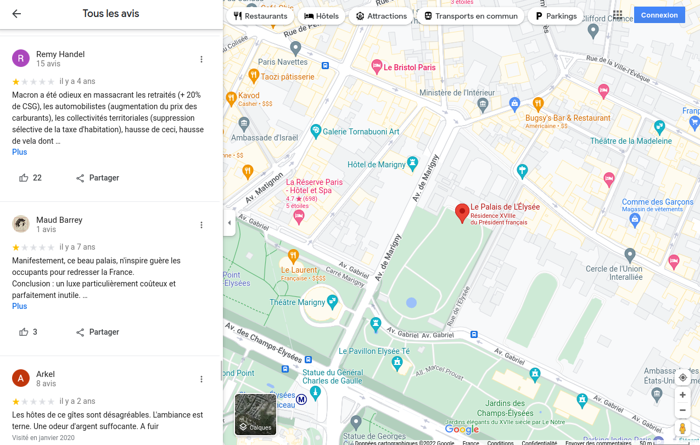

<!-- # When Virtual Spaces Are Creatively Hijacked For Political Expression -->
# Quand les espaces virtuels sont détournés pour y publier des messages politiques

<!-- In the 70's and 80's, while the Internet was still in the works, the first networked communities started emerging. The tech enthusiasts forming them often held a [strong belief in the emancipatory potential](https://fredturner.stanford.edu/wp-content/uploads/turner-tc-counterculture-new-economy.pdf) of communication technologies. They thought that the wild and chaotic virtual spaces that were being opened up, would enable a truly democratic society to emerge. A society premised on radical freedom of expression, everyone having the technological means to speak to everyone else, therefore maximizing individual and collective intelligence. -->

Dans les années 1970 et 1980, alors que l'Internet était encore en gestation, les premières communautés en réseau commencèrent à apparaître. Celles-ci étaient constituées de passionnés qui, bien souvent, avaient [une foi énorme en le potentiel émancipateur des technologies de la communication](https://fredturner.stanford.edu/wp-content/uploads/turner-tc-counterculture-new-economy.pdf). Ils pensaient que les espaces virtuels vastes et chaotiques qui étaient en train de naître permettraient l'émergence d'une société véritablement démocratique. Une société basée sur une liberté d'expression radicale, dans laquelle chaque personne aurait les moyens technologiques de parler à chaque autre personne, maximisant ainsi l'intelligence individuelle et collective.

<!-- Eventually the Internet became mainstream, everyone did get the technological means to speak, and the amount of information available exploded. A new bottleneck then appeared : listening, the human brain and the limited amount of information it can process. This marked the rise of the *attention economy*, a new condition in which human *attention* became a scarce resource that corporations such as Facebook and Google started extracting and selling. -->

Puis l'Internet fut mis en place et adopté par les masses, chacun eut à sa disposition les moyens technologiques de s'exprimer, et la quantité d'information disponible explosa. Très vite, une nouvelle limite s'imposa : le cerveau humain et la quantité limitée d'information qu'il est capable de traiter. Ceci marqua l'émergence de "l'économie de l'attention", une nouvelle condition dans laquelle l'attention humaine est une ressource rare que des entreprises telles que Facebook et Google commencèrent à extraire et à vendre.

<!-- The rest of course is history. The prophesied renewal of democracy didn't take place. Instead we saw a corporate takeover of these virtual spaces, resulting in [mass](https://theintercept.com/2019/07/11/china-surveillance-google-ibm-semptian/) censorship, the [commodification of human behaviour at scale](https://www.theguardian.com/news/series/cambridge-analytica-files) and a toxic polarization of public debate. The violent mechanics of the attention economy are slowly [eroding people's agency](https://medium.com/thrive-global/how-technology-hijacks-peoples-minds-from-a-magician-and-google-s-design-ethicist-56d62ef5edf3) and [silencing activists' voices](https://gizmodo.com/facebook-follows-up-vow-to-fight-climate-change-with-ma-1845139884).  -->

Bien sûr, le renouveau de la démocratie qui était prophétisé n'eut pas lieu. À sa place, advint un accaparement de ces espaces virtuels par l'industrie qui produisit de la [censure de masse](https://theintercept.com/2019/07/11/china-surveillance-google-ibm-semptian/), la [marchandisation du comportement humain à grande échelle](https://www.theguardian.com/news/series/cambridge-analytica-files) et une polarisation toxique du débat public. Les mécaniques implacables de l'économie de l'attention [réduisent au silence les activistes](https://gizmodo.com/facebook-follows-up-vow-to-fight-climate-change-with-ma-1845139884), et neutralisent progressivement [la capacité d'action des populations](https://medium.com/thrive-global/how-technology-hijacks-peoples-minds-from-a-magician-and-google-s-design-ethicist-56d62ef5edf3).

<!-- Regardless, and even as [it is being muted](https://about.fb.com/news/2021/02/reducing-political-content-in-news-feed/), political expression overflows at the margins. People break online platforms' rules in any way they can or form communities powerful enough to manipulate the algorithms of social media feeds. The following is a heterogenous compilation of such hijacks. It documents unexpected and creative ways in which individuals or groups reclaim their political agency through the (mis)use of communication technologies. What do these examples tell us ? Do they symbolise early network utopias being alive and well ? Or on the contrary, are they a symptom (yet another) of their deep corruption by private interests ? -->

Pourtant, alors même que les entreprises de la tech tentent [d'étouffer l'expression d'opinions politiques](https://about.fb.com/news/2021/02/reducing-political-content-in-news-feed/), celles-ci fourmillent aux marges. Les utilisateurs brisent les règles des plateformes en employant tous les moyens à leur disposition, ou se structurent en communautés virtuelles suffisamment puissantes pour manipuler les algorithmes des réseaux sociaux.

La suite de cet article est une compilation choisie de ces détournements. Elle documente les méthodes créatives et inattendues utilisées par des individus ou des groupes pour tenter de se réapproprier leur capacité d'action à travers l'utilisation des technologies de la communication. Que nous disent ces exemples ? Sont-ils la preuve de la bonne santé de l'utopie des réseaux ? Ou sont-ils, au contraire, un symptôme de la profonde corruption de ces utopies par des intérêts privés ?

<!-- ## Spam and Other Incongruous Content -->
## Spam et autres contenus incongrus

<!-- Spamming is, [according to media scholar Finn Brunton](https://direct.mit.edu/books/book/3708/SpamA-Shadow-History-of-the-Internet), "the project of leveraging information technology to exploit existing gatherings of attention". Spam infiltrates virtual spaces through every crack available. It appears by surprise on platforms where user content is otherwise heavily policed. Of course, a vast majority of it consists in senseless scam messages. But political expression can sometimes take the form of spam too. -->

[D'après le chercheur en nouveaux médias Finn Brunton](https://direct.mit.edu/books/book/3708/SpamA-Shadow-History-of-the-Internet), le spam est "l'utilisation des technologies de l'information dans le but d'exploiter des filons d'attention existants" (TDLA). Le spam s'infiltre dans les espaces virtuels par chacune de leurs fissures. On tombe dessus, par surprise, sur des plateformes où la création de contenu est par ailleurs strictement contrôlée. Très souvent, ce sont des tentatives d'arnaques, dont certaines peuvent même paraître amusantes. Mais l'expression de messages politiques peut parfois aussi prendre la forme de spam. 

<!-- ### On Google Maps -->
### Sur Google Maps

<!-- If you search on Google Maps for ["BNP, Paris Saint Paul"](https://www.google.com/maps/place/BNP+Paribas+-+Paris+Saint+Paul+-+Le+Marais/@48.8555584,2.3581174,17z/data=!3m1!4b1!4m5!3m4!1s0x47e671fdf0f0dfef:0x66c7c3466c35a223!8m2!3d48.855622!4d2.3603449) and go to the photo section, here's what you'll see :  -->

En cherchant sur Google Maps ["BNP, Paris Saint Paul"](https://www.google.com/maps/place/BNP+Paribas+-+Paris+Saint+Paul+-+Le+Marais/@48.8555584,2.3581174,17z/data=!3m1!4b1!4m5!3m4!1s0x47e671fdf0f0dfef:0x66c7c3466c35a223!8m2!3d48.855622!4d2.3603449) et en allant voir la liste des photos, on peut y trouver une image de l'antenne rue de Rivoli de la banque BNP, décorée d'un énorme graffiti "BRÛLONS LES BANQUES".

<!-- There's a lot more content on Google maps that would fit in the spam category. This includes political rants, despite the fact that they are explicitly forbidden by the content policy : ["maps is not meant to be a forum for general political, social commentary, or personal rants. Content that does not meet this standard will be removed"](https://support.google.com/contributionpolicy/answer/7400114?hl=en&ref_topic=7422769#zippy=%2Coff-topic). Here's how to easily find some of these :  -->

Google Maps contient des tonnes de contenu qui pourrait être classé dans la catégorie spam. On y trouve, entre autres, des coups de gueule politiques, bien que ceux-ci soient explicitement interdits par le règlement relatif aux contenus : ["Maps n'a pas vocation à devenir une tribune propageant des attaques personnelles, ou des commentaires politiques ou sociaux. Les contenus qui ne respectent pas cette règle seront supprimés."](https://support.google.com/contributionpolicy/answer/7400114?hl=fr&ref_topic=7422769#zippy=%2Coff-topic%2Ccontenus-hors-sujet). Voici pourtant comment en trouver facilement :

<!-- - Search for a major political institution in any country (for example the [House of Commons](https://www.google.com/maps/place/House+of+Commons/@51.4999428,-0.126805,17z/data=!4m7!3m6!1s0x487604c300a74337:0xc755a7d3920c4037!8m2!3d51.4999428!4d-0.124611!9m1!1b1), which is the national parliament in the UK)
- Open the "Reviews" section
- Sort by "Lowest rating" -->

- Chercher une institution politique majeure dans n'importe quel pays (par exemple [Le Palais de L'Élysée](https://www.google.com/maps/place/%C3%89lys%C3%A9e+Palace/@48.8697906,2.3142833,17z/data=!3m1!4b1!4m5!3m4!1s0x47e66fce8ca6e347:0x2e38f4467a582f22!8m2!3d48.8697906!4d2.3164773))
- Ouvrir la section "avis"
- Trier par "avis les moins favorables"

Les commentaires pour le palais de l'Élysée sont un bon exemple de ce qu'on peut trouver pour à peu près tous les sièges de pouvoir politique :

- "Les hôtes de ce gîtes sont désagréables. L'ambiance est terne. Une odeur d'argent suffocante. A fuir"
- "Je met une étoile à cause du Macron.. bien que j'adore ce monument mais lui je ne peux plus me le voir"
- "Splendide architecture. C'est un lieu très franchement magnifique. Dommage que les propriétaires soient aussi haïssables."

etc...

<!-- ### Staged Protests in Video Games -->
### Manifestations virtuelles dans des jeux vidéos

<!-- Spam's pervasiveness shows that any technology, if it has some degree of openness, will be misused. There are, for example, many cases of people hijacking video games to spread a political message.  -->

L'omniprésence du spam montre que toute technologie, si elle a un certain degré d'ouverture, sera forcément utilisée pour un autre but que celui pour lequel elle a été conçue. Il y a, par exemple, de nombreux cas de détournements de jeux vidéo pour y diffuser un message politique.

<!-- "dead in iraq" is a live performance realized by artist Joseph DeLappe in 2006, and an early example of political spam / hijack of an online game. This performance takes place inside ["America's Army"](https://www.americasarmy.com/), the "Official Game of the U.S. Army" and a platform for recruiting new soldiers. DeLappe joins the game as a player and starts enumerating the names of American soldiers who died during the Iraq war using the in-game chat, thus flooding the conversation and angering other players.  -->

"dead-in-iraq" est une performance live réalisée par l'artiste Joseph DeLappe en 2006, et un exemple précoce de spam politique dans un jeu vidéo en ligne. Cette performance se déroule dans ["America's Army"](https://www.americasarmy.com/), le "jeu vidéo officiel de l'armée des États-Unis" (TDLA) qui est en fait une plateforme pour recruter de nouveaux soldats. DeLappe se connecte au jeu et entame une longue énumération des noms des soldats américains morts durant la guerre en Irak. Pour ce faire, il utilise le clavardage du jeu, inondant ainsi la conversation et exaspérant par la même occasion les autres joueurs.

<!--
DeLappe's messages serve as an ["online memorial to those military personnel who have been killed", and a "cautionary gesture" to the potential new recruits](http://www.delappe.net/project/dead-in-iraq/). -->

Le message de DeLappe fonctionne comme ["un mémorial en ligne au personnel militaire qui a été tué", ainsi qu'une "mise en garde" aux potentielles nouvelles recrues](http://www.delappe.net/project/dead-in-iraq/) (TDLA).

<iframe width="560" height="315" src="https://www.youtube.com/embed/VTnuUMM7frk" title="YouTube video player" frameborder="0" allow="accelerometer; autoplay; clipboard-write; encrypted-media; gyroscope; picture-in-picture" allowfullscreen></iframe>

<!--
Other times, the game platform is not used directly for spamming, but rather as a set to a virtual protest, which will then be filmed and published on other media. Such performances have had success during the early days of the covid pandemic, when activists were forced to invent new approaches compatible with confinement. -->

Dans certains cas, la plateforme de jeu n'est pas utilisée directement pour spammer, mais plutôt comme lieu de rassemblement pour une manifestation virtuelle, qui sera filmée, puis publiée sur d'autres médias (en particulier sur les réseaux sociaux). Ce type d'évènements rencontra un certain succès au début de la pandémie de Covid, quand de nombreux activistes furent forcés d'inventer de nouveaux modes d'action compatibles avec le confinement.

<!-- During the Black Lives Matter (BLM) protests in 2020 for example, virtual rallies were held in several video games such as the Sims or Animal Crossing. -->

Durant les mobilisations du mouvement Black Lives Matter (BLM) en 2020, des rassemblements virtuels furent par exemple organisés dans plusieurs jeux vidéo tels que les Sims ou Animal Crossings.

<!-- Both of these games provide creation tools which enabled designers to craft virtual [BLM-themed](https://www.ebonix.com/) [accessories](https://nooksisland.com/designs?search=black+lives+matter). Activists then equipped their avatars with these accessories and gathered in the same local or online game to enact marches and chants. The virtual protest is screenshot or filmed, and shared on social media in order to raise awareness or funds for the cause. -->

Ces jeux offrent tous deux des outils de création qui permirent la confection [d'accessoires virtuels](https://nooksisland.com/designs?search=black+lives+matter) (vêtements, banderoles) sur le [thème de BLM](https://www.ebonix.com/). Des activistes équipèrent alors leurs avatars avec ces accessoires, et se rassemblèrent dans une partie en ligne ou locale pour y défiler et y scander des slogans. Des captures d'écran furent ensuite prises et partagées sur les réseaux sociaux pour sensibiliser le public ou pour lever des fonds pour le mouvement BLM.

<blockquote class="twitter-tweet">
tonight's vigil in south newcrest <a href="https://twitter.com/hashtag/BLMSimsRally?src=hash&amp;ref_src=twsrc%5Etfw">#BLMSimsRally</a> <a href="https://t.co/iQKhQnkrjS">pic.twitter.com/iQKhQnkrjS</a>
&mdash; 𝖌𝖚𝖈𝖈𝖎 𝖘𝖎𝖒𝖘 (@GUCClSIMS) <a href="https://twitter.com/GUCClSIMS/status/1269819139364962307?ref_src=twsrc%5Etfw">June 8, 2020</a></blockquote> 

<blockquote class="twitter-tweet">
Thank you for the overwhelming support towards our animal crossing <a href="https://twitter.com/hashtag/BlackLivesMatter?src=hash&amp;ref_src=twsrc%5Etfw">#BlackLivesMatter</a> march and fundraiser. Big 🖤🖤🖤 to ALL who turned out so passionately and especially <a href="https://twitter.com/pingguino?ref_src=twsrc%5Etfw">@pingguino</a> and <a href="https://twitter.com/mpinner?ref_src=twsrc%5Etfw">@mpinner</a> for creative support. <a href="https://twitter.com/hashtag/acnh?src=hash&amp;ref_src=twsrc%5Etfw">#acnh</a> <a href="https://t.co/U0IvnZb6ZP">pic.twitter.com/U0IvnZb6ZP</a>
&mdash; Adelle @ happy juneteenth! (@Adellelin) <a href="https://twitter.com/Adellelin/status/1274886969927983108?ref_src=twsrc%5Etfw">June 22, 2020</a></blockquote> 

<!-- ### Overcoming Censorship -->
### Contourner la censure

<!-- On virtual platforms which are not originally designed for public discussion, political content is often not expected to be found. This allows some of these platforms to stay below the radar of the state authorities which would normally censor speech.  -->

De nombreuses plateformes virtuelles n'étant pas conçues pour être des lieux de discussion, on ne s'attend pas à y trouver de contenu politique. Ainsi, ces plateformes échappent parfois au contrôle d'États autoritaires, qui appliquent par ailleurs une politique de censure stricte au moindre discours dissident.

<!-- In early 2019, the government of Hong Kong [introduced an extradition bill](https://www.nytimes.com/2019/06/10/world/asia/hong-kong-extradition-bill.html) which many feared would make it easier for the Chinese government to arrest Hong Kong political dissidents. This event led to 2 years of pro-democracy protests, with millions of people marching in the streets and increased government repression on the people of Hong Kong. Protesters have then had to innovate in order to stay mobilized and evade police surveillance. [It was for example reported](https://www.scmp.com/abacus/culture/article/3021560/how-hong-kong-protesters-are-using-tinder-and-pokemon-go) that they started to use dating app Tinder or Apple AirDrop to publicly share info on events and marches. -->

Au début de l'année 2019, le gouvernement de Hong Kong [introduisit une proposition de loi](https://www.nytimes.com/2019/06/10/world/asia/hong-kong-extradition-bill.html) facilitant les arrestations d'opposants politiques par le gouvernement chinois. Cet évènement marqua le début de deux années de lutte pour la défense de la démocratie, durant lesquelles des millions de personnes manifestèrent dans les rues de Hong Kong. Il marqua en parallèle le début d'une forte répression du gouvernement hongkongais contre son peuple. Les manifestants durent alors innover afin de rester mobilisés tout en échappant à la surveillance policière. [Des articles rapportent par exemple](https://www.scmp.com/abacus/culture/article/3021560/how-hong-kong-protesters-are-using-tinder-and-pokemon-go) l'utilisation de l'application de rencontre Tinder ou d'Apple AirDrop pour partager des informations sur les prochains évènements et manifestations.

<blockquote class="twitter-tweet">
So it's come to this—I'm getting protest info on Tinder <a href="https://t.co/bMfRYCJv1T">pic.twitter.com/bMfRYCJv1T</a>
&mdash; Gavin Huang 黄藹禧 (@GavinHuang) <a href="https://twitter.com/GavinHuang/status/1156988179678785536?ref_src=twsrc%5Etfw">August 1, 2019</a></blockquote> 

<blockquote class="twitter-tweet">
Finally got airdropped stuff on the train. Posters calling for a general strike next Monday <a href="https://twitter.com/hashtag/FreedomHK?src=hash&amp;ref_src=twsrc%5Etfw">#FreedomHK</a> <a href="https://t.co/UPTjSLITUY">pic.twitter.com/UPTjSLITUY</a>
&mdash; Zoe Low (@ziqinglow) <a href="https://twitter.com/ziqinglow/status/1157293482383253504?ref_src=twsrc%5Etfw">August 2, 2019</a></blockquote> 

<!-- When the Hong Kong demonstrations were slowed down by the pandemic in early 2020, [activists took their political message to Animal Crossing](https://www.wired.co.uk/article/animal-crossing-hong-kong-protests-coronavirus) - just as the BLM protesters did. The video game has granted them a safe virtual space where they can [gather respectfully of social distancing rules](https://www.scmp.com/lifestyle/entertainment/article/3079128/how-nintendos-animal-crossing-became-home-hong-kong). -->

En 2020, quand la pandémie de Covid mit un frein aux mobilisations, [les activistes hongkongais investirent alors le jeu Animal Crossing](https://www.wired.co.uk/article/animal-crossing-hong-kong-protests-coronavirus) - comme l'avaient fait les activistes BLM. Le jeu vidéo leur assura un "safe space" virtuel où ils purent [se rassembler tout en restant confinés](https://www.scmp.com/lifestyle/entertainment/article/3079128/how-nintendos-animal-crossing-became-home-hong-kong).

<blockquote class="twitter-tweet">
Animal Crossing is Fast Becoming a New Way for Hong Kong Protesters to Fight for Democracy! The <a href="https://twitter.com/hashtag/Covid_19?src=hash&amp;ref_src=twsrc%5Etfw">#Covid_19</a> pandemic has halted public demonstrations, so protesters are taking their cause to <a href="https://twitter.com/hashtag/AnimalCrossing?src=hash&amp;ref_src=twsrc%5Etfw">#AnimalCrossing</a>.<a href="https://t.co/A599kjlYsV">https://t.co/A599kjlYsV</a>   (This is my island!) <a href="https://t.co/vjBhzw1nUa">pic.twitter.com/vjBhzw1nUa</a>
&mdash; Joshua Wong 黃之鋒 😷 (@joshuawongcf) <a href="https://twitter.com/joshuawongcf/status/1245639425331056640?ref_src=twsrc%5Etfw">April 2, 2020</a></blockquote>  

<!-- In 2020, the freedom of press organization [Reporters Without Borders](https://rsf.org/) (RSF) also demonstrated [a fantastic example](https://uncensoredlibrary.com/en) of use of a video game to avoid state censorship. They put up a Minecraft server which any player in the world can connect to. On this server, there is a spectacular neo-classical library building [painstakingly crafted](https://uncensoredlibrary.com/en/v/making-of) using 12.5 millions of blocks, and in this library building, players can find more than 200 books and articles which have been censored in their country of origin. -->

En 2020, l'organisation de défense de la liberté de la presse [Reporters Sans Frontières](https://rsf.org/) (RSF) démontra un autre [fantastique exemple](https://uncensoredlibrary.com/en) d'utilisation d'un jeu vidéo pour contourner la censure d'État. Un serveur du jeu vidéo Minecraft fut mis en place pour permettre à des joueurs n'importe où dans le monde de se connecter. Dans le monde virtuel hébergé sur ce serveur, les joueurs pouvaient visiter une bibliothèque monumentale au style néo-classique, [assemblage méticuleux](https://uncensoredlibrary.com/en/v/making-of) de 12,5 millions de petits blocs. Celle-ci hébergeait plus de 200 livres et articles censurés dans leurs pays d'origine, mais qui étaient offerts ici en consultation libre.

<!-- Although the project is partly symbolic (and a PR stunt), it did effectively enable RSF to smuggle these writings back into the countries from which they were banned. -->

Bien que le projet ait plutôt eu une portée symbolique (en plus d'être un beau coup de com'), il permit à RSF de réintroduire clandestinement ces ouvrages dans les pays desquels ils avaient été bannis.

<iframe width="560" height="315" src="https://www.youtube.com/embed/EBI7-pL52GY" title="YouTube video player" frameborder="0" allow="accelerometer; autoplay; clipboard-write; encrypted-media; gyroscope; picture-in-picture" allowfullscreen></iframe>

<!-- ## Fake News and Hoaxes -->
## Fake news et canulars

<!-- Fake news has been a much discussed topic in recent years, especially in regard to their impact on public discourse and democracy. Research has found that [fake news spread faster and further](https://science.sciencemag.org/content/359/6380/1146) than real news on social media. -->

Le sujet des "fake news" a été largement discuté ces dernières années, posant notamment la question de leur impact sur le débat public et sur la démocratie. Des recherches ont par exemple montré que [les fake news se répandent plus vite et vont plus loin](https://science.sciencemag.org/content/359/6380/1146) que les vraies news sur les réseaux sociaux.

<!-- By striking the sweet spot between plausible and preposterous, a well crafted online hoax has the power to summon the same forces that make fake news so efficient at hijacking attention. Tricksters and activists have long used this form of action as a [means to reclaim public attention for various causes](https://ijoc.org/index.php/ijoc/article/view/1286). Contrary to fake news though, hoaxes are [always revealed after the joke played out](https://theyesmen.org/rant/era-fake-news-good-has-rebegun). -->

Lorsque vraisemblance et scandale sont correctement dosés, canulars et fake news partagent une même faculté à capter l'attention du public. Farceurs et activistes utilisent d'ailleurs depuis longtemps le canular comme [forme d'action pour visibiliser certaines causes](https://ijoc.org/index.php/ijoc/article/view/1286). Le propre d'un canular est cependant d'être révélé une fois ses objectifs remplis, alors que la fake news reste, pollution permanente du paysage des réseaux sociaux.

<!-- ### The Yes Men -->
### Les Yes Men

<!-- When talking about online hoaxes and tricks, it is impossible not to mention [the Yes Men](https://theyesmen.org), which started as a two-people project in the late 90's, and has since industrialised the process of producing [fake websites](https://theyesmen.org/hijinks-all?view=fake_websites_embed_block). -->

S'agissant de canulars et de farces en ligne, il est difficile de ne pas mentionner [les Yes Men](https://theyesmen.org), un projet lancé dans la fin des années 1990 par deux artistes, et qui ont depuis quasiment industrialisé la production de [faux sites web](https://theyesmen.org/hijinks-all?view=fake_websites_embed_block).

<!-- In 1999, they realized their first hoax accidentally by setting up a [fake website of the World Trade Organisation](https://gatt.org.theyesmen.org/homewto.html) (WTO). While the page copies the visual identity of the WTO of that time, it is however full of ironic news and anti-capitalist writings. In spite of this, people fell for it. Several business conferences inadvertently booked the Yes Men to give a talk.  -->

En 1999, les Yes Men réalisèrent leur premier canular accidentellement lorsqu'ils mirent en ligne un [faux site web de l'Organisation Mondiale du Commerce](https://gatt.org.theyesmen.org/homewto.html) (OMC). Cette page copiait l'identité visuelle de l'OMC tout en étant remplie de titres ironiques et d'articles anticapitalistes. Contre toute attente, de nombreuses personnes crurent avoir affaire au vrai site de l'OMC, et plusieurs conférences invitèrent par inadvertance les Yes Men à donner une présentation en qualité de représentants officiels de l'organisation.

<!-- The Yes Men consider the websites that they produce as representing their opponents ["more transparently than they ever present themselves"](https://theyesmen.org/hijinks-all?view=fake_websites_embed_block), therefore "making these true websites, not fake". The message is almost always fact-based, and aims at exposing an organisation and its wrong-doings, usually in order to mobilize support for a broader campaign. -->

Les Yes Men considèrent que les sites qu'ils produisent présentent leurs cibles ["avec plus de transparence qu'elles ne se présenteront jamais elles-mêmes"](https://theyesmen.org/hijinks-all?view=fake_websites_embed_block), ce qui rend "ces sites véridiques, et non fake" (TDLA). Ces sites visent en général à dénoncer une organisation et ses crimes, souvent dans le but de mobiliser le soutien du public dans le cadre d'une campagne plus large.

<iframe width="560" height="315" src="https://www.youtube.com/embed/40q4cPNXfF0" title="YouTube video player" frameborder="0" allow="accelerometer; autoplay; clipboard-write; encrypted-media; gyroscope; picture-in-picture" allowfullscreen></iframe>

### Pooper

<!-- At other times, a hoax can also be a form of social commentary, a work of fiction which magnifies some of the absurdities of society. -->

Dans d'autres cas, un canular peut aussi être une forme de commentaire social, une œuvre satirique qui révèle certaines des absurdités de notre société.

<!-- In 2016, two startup bros announced the release of a new app called [Pooper](http://pooperapp.com/) that was to be the "Uber For Dog Poop". Basically, your dog poops, you fire the app, take a geolocated picture of the poop, and an independent contractor called a "scooper" will then come to clean it. -->

En 2016, deux startupers annoncèrent le lancement d'une nouvelle application nommée [Pooper](http://pooperapp.com/) (littéralement "crotteur" en français), qui était présentée comme le "Uber pour crottes de chien" (TDLA). En gros, votre chien fait une crotte, vous lancez l'appli, prenez une photo géolocalisée de la crotte, et un sous-traitant indépendant appelé un "scooper" arrivera alors pour tout nettoyer.

<!-- The news got quickly picked up by the press in the US and beyond, even though some of the journalists were already suspicious about the fact that this was actually a hoax. Regardless, [public interest rose](https://www.newsweek.com/how-media-got-fooled-completely-satirical-dog-poop-app-485598), so much so that hundreds of people signed-up, and real investors contacted the tricksters to see if they could invest in the new app. -->

La nouvelle fut rapidement relayée par la presse aux États-Unis et à l'international, alors même que certains journalistes suspectaient déjà un canular. En dépit des soupçons, [de nombreuses personnes manifestèrent leur intérêt](https://www.newsweek.com/how-media-got-fooled-completely-satirical-dog-poop-app-485598). L'application reçut des centaines d'inscriptions et des investisseurs contactèrent les entrepreneurs pour leur proposer de financer leur projet.

<!-- A few days later, the creators revealed the joke to be ["an art project that satirizes our app-obsessed world"](https://www.newsweek.com/how-media-got-fooled-completely-satirical-dog-poop-app-485598), and a comment on the inanity and exploitativeness of many of the new businesses operating under the label of the "sharing economy". -->

Quelques jours plus tard, les deux farceurs révélèrent le canular. Ils annoncèrent alors que l'application n'était autre qu'un ["projet artistique satirisant notre monde obsédé par les applis"](https://www.newsweek.com/how-media-got-fooled-completely-satirical-dog-poop-app-485598), et un commentaire sur l'exploitation et l'inanité de nombreuses entreprises qui se positionnent comme actrices de la "sharing economy" ("l'économie de partage").

<iframe width="560" height="315" src="https://www.youtube.com/embed/eC14Ohz5h4Q" title="YouTube video player" frameborder="0" allow="accelerometer; autoplay; clipboard-write; encrypted-media; gyroscope; picture-in-picture" allowfullscreen></iframe>

<!-- ### The Shed At Dulwich -->
### "The Shed At Dulwich"

<!-- Oobah Butler is a journalist for VICE, who used to be paid writing fake reviews for restaurants. In 2017, knowing how the mechanics of reviewing websites such as Trip Advisor worked, he decided to try a [little experiment](https://www.vice.com/en/article/434gqw/i-made-my-shed-the-top-rated-restaurant-on-tripadvisor). He would create a page on Trip Advisor for a restaurant that didn't exist, "The Shed At Dulwich", and try to make it the number #1 restaurant in the whole of London.  -->

Avant de devenir journaliste pour VICE, Oobah Butler était payé pour écrire de faux avis en ligne pour des restaurants. En 2017, il utilisa les connaissances qu'il avait acquises dans son ancien travail pour tenter [une petite expérience](https://www.vice.com/en/article/434gqw/i-made-my-shed-the-top-rated-restaurant-on-tripadvisor). Il créa une page sur le site de conseils touristiques Tripadvisor (très populaire à l'époque) pour un restaurant entièrement fictif qu'il nomma "The Shed At Dulwich". Son objectif était de le faire grimper à la première place des restaurants pour Londres.

<!-- After six months of asking his friends to write fake 5-star reviews and ghosting real customers desperate to book a table, he eventually made it to the first place.  -->

Après six mois, durant lesquels il recruta ses amis pour écrire et publier de faux avis élogieux, tout en évitant les hordes de clients qui essayaient désespérément de réserver une table, le restaurant parvint à atteindre la tête du classement.

<!-- His experiment, a comment on the online reputation economy (stars, likes, follows, ...), proved that Trip Advisor was, in his words, a "false reality". It also illustrates more generally how competition for attention has created a perverse incentive for people to try and manipulate online platforms, therefore turning the Internet into a place where [a lot of things are fake](https://nymag.com/intelligencer/2018/12/how-much-of-the-internet-is-fake.html).   -->

Son expérience, une critique de l'économie de la réputation en ligne (étoiles, likes, follows, …), prouva que Tripadvisor était, selon les dires d'Oobah, une "fausse réalité". Elle illustre aussi plus généralement les effets pervers de la compétition pour l'attention qui amène de nombreuses personnes et entreprises à falsifier leurs profils virtuels, transformant ainsi l'Internet en [un endroit où tout ou presque est fictif](https://nymag.com/intelligencer/2018/12/how-much-of-the-internet-is-fake.html).

<iframe width="560" height="315" src="https://www.youtube.com/embed/bqPARIKHbN8" title="YouTube video player" frameborder="0" allow="accelerometer; autoplay; clipboard-write; encrypted-media; gyroscope; picture-in-picture" allowfullscreen></iframe>

<!-- ## Strength in Numbers -->
## La force du nombre

<!-- In the past 20 years, thanks to the participatory web, we have seen the emergence of decentralized communities which can count up to millions of people and span the entire planet. Their members share a common interest or the same virtual hangout, and they often develop a deep and complex culture made up of unique slang, inside jokes and memes. -->

Grâce au web participatif, les vingt dernières années ont vu l'émergence de communautés décentralisées dont certaines comptent des millions de membres répartis sur l'ensemble de la planète. Elles sont en général structurées autour d'un repaire virtuel et/ou d'intérêts communs, et développent une culture complexe, constituée de jargons uniques, de private jokes et de mèmes.

<!-- One of the strengths of these communities is their leaderless nature, which enables the emergence of a form of collective intelligence, where the best ideas spread fast and far. On the other hand, the lack of structure also induces these movements to be chaotic and to rarely have a clear political agenda or a long term strategy. -->

La force de ces communautés réside dans leur grande taille ainsi que dans leur horizontalité (absence de leaders), encourageant le foisonnement des idées, et permettant alors l'émergence d'une forme d'intelligence collective. En revanche, ces mêmes caractéristiques les rendent aussi chaotiques, et empêchent la formation d'une stratégie sur le long terme ou même d'une ligne politique claire.

<!-- Belonging to these communities can become an important part of their members' personal identities, sometimes up to a point of collective narcissism. Through the power of the collective, people reclaim their individual agency and assert their existence in the broader media environment. -->

Pour leurs membres, l'appartenance à ces communautés peut devenir une part importante de leurs identités personnelles, menant parfois jusqu'à une forme de narcissisme collectif. À travers la force du nombre, ces gens se réapproprient leur capacité d'action et affirment leur existence dans un paysage médiatique et numérique saturé.

### Anonymous

<!-- "Anonymous" is probably the most famous of these online communities. It is a decentralized and leaderless activist movement known mostly for its cyberattacks. It is multi-faceted, consists of different sensitivities brought together by the joys of trolling, and by a radical position towards defending freedom of speech. -->

"Anonymous" est probablement la plus célèbre de ces communautés en ligne. C'est un mouvement d'hacktivistes, décentralisé et horizontal, connu principalement pour ses cyberattaques. C'est aussi un mouvement dont les membres ont des sensibilités très variées, mais qui partagent néanmoins un goût certain pour les joies du trolling et une position commune envers la défense d'une vision radicale de la liberté d'expression.

<!-- Anonymous originated in the early 2000s, from the inside jokes of the imageboard 4chan, a website where users could post anonymously and by doing so appeared under the username "Anonymous". The name of the movement then came up as a gag : what if all these "Anonymous" users, what if 4chan was actually just one person ?  -->

Anonymous est né des *private jokes* de l'imageboard (un type de forum en ligne) 4chan au début des années 2000. Ce site web permettait aux utilisateurs de poster de manière anonyme, ce qui les faisait apparaître sous le pseudo "Anonymous". Le nom du mouvement fut alors adopté comme une blague : et si tous ces utilisateurs "Anonymous", et si le site 4chan dans son entièreté, …n'étaient en réalité qu'une seule et même personne ?

<!-- It is hard to tell a single, concise story of Anonymous, since it is so complex, oftentimes incoherent. Many posts on 4chan are deeply racist and misogynistic, but on the other hand, Anonymous activists often took direct action against homophobia, racism, and different forms of oppression, ... -->

Il est difficile de présenter Anonymous de manière simple et concise, tant c'est une communauté complexe, souvent incohérente. Bien que de nombreux posts sur 4chan soient par exemple terriblement racistes et/ou misogynes, les activistes d'Anonymous se sont souvent mobilisés pour combattre l'homophobie, le racisme et diverses autres formes d'oppression.

<!-- In 2010, Anonymous launched "Operation Payback", a series of cyberattacks on various copyrights and [financial organizations](https://www.theguardian.com/world/2010/dec/08/wikileaks-visa-mastercard-operation-payback). They managed to take down several important websites, including Visa, Mastercard and PayPal which subsequently [claimed 3.5 million pounds in damages](https://www.bbc.com/news/uk-20449474). -->

En 2010, Anonymous lança "Operation Payback", une série de cyberattaques [ciblant des organisations financières](https://www.theguardian.com/world/2010/dec/08/wikileaks-visa-mastercard-operation-payback) et organisations de défense du copyright. Anonymous réussit alors à faire crasher plusieurs gros sites web, dont Visa, Mastercard et PayPal, qui [réclamèrent plus tard 3,5 millions de livres sterling en dommages et intérêts](https://www.bbc.com/news/uk-20449474).

<iframe width="560" height="315" src="https://www.youtube.com/embed/bl2_-NYm6yA" title="YouTube video player" frameborder="0" allow="accelerometer; autoplay; clipboard-write; encrypted-media; gyroscope; picture-in-picture" allowfullscreen></iframe>

### K-pop Stans

<!-- The obsessive K-Pop fans (also called "K-pop Stans") is another online community which, with its plurality, its love of memes, and [its own problem with racism](https://www.vox.com/2020/6/22/21295700/k-pop-fan-activism-black-lives-matter-trump-rally-racism-cultural-appropriation-reset-podcast), has often been [compared to Anonymous](https://www.technologyreview.com/2020/06/23/1004336/tiktok-teens-kpop-stans-trump-resistance-its-complicated). The Stans are very active on platforms such as TikTok and Twitter, where they relentlessly share content on their favorite bands. Thanks to their great numbers and their coordination, the K-pop Stans have collectively become experts at hijacking visibility on social media, in order to promote the artists that they admire, and make them appear at the top of the feeds. -->

Les fans de musique pop coréenne (appelés aussi les "K-pop Stans") constituent une autre communauté en ligne qui, de par sa pluralité, son amour des mèmes, et ses [problèmes de racisme](https://www.vox.com/2020/6/22/21295700/k-pop-fan-activism-black-lives-matter-trump-rally-racism-cultural-appropriation-reset-podcast), a souvent été [comparée à Anonymous](https://www.technologyreview.com/2020/06/23/1004336/tiktok-teens-kpop-stans-trump-resistance-its-complicated). Les Stans sont très actifs sur des plateformes comme TikTok et Twitter, où ils partagent sans relâche du contenu sur leurs groupes favoris. Grâce à leur nombre et à leur grande coordination, les K-pop Stans ont collectivement appris à manipuler les algorithmes des réseaux sociaux. Ils utilisent d'ordinaire cette compétence pour promouvoir les artistes qu'ils admirent et les faire apparaître en haut des feeds (fils d'actualité des réseaux sociaux).

<!-- In 2020, in the midst of the Black Lives Matter (BLM) protests in the US, the K-pop stans suddenly appeared in the limelight on western media. It started with the Stan's effort to invisibilize racist tweets and discussions, through the [flooding of anti-BLM hashtags](https://twitter.com/search?q=(%23WhiteLivesMatter)%20until%3A2020-06-04%20since%3A2020-06-03%20-filter%3Areplies&src=typed_query&f=live) on Twitter. It continued with [crashing the Dallas police app](https://twitter.com/DallasPD/status/1267236088755695618) by spamming it with fancams (close-up videos of their idols). Finally, it culminated in [crashing the party at Trump's first post-covid campaign rally](https://www.nytimes.com/2020/06/21/style/tiktok-trump-rally-tulsa.html). The K-pop stans had organised a "no-show" protest, by discreetly booking as many free tickets as they could, and then simply not coming to the meeting, leaving many of the seats empty. -->

En 2020, au plus fort de la mobilisation du mouvement des Black Lives Matter (BLM) aux États-Unis, les K-pop Stans firent une apparition soudaine dans la presse occidentale. Tout commença par leurs efforts pour invisibiliser les tweets et discussions racistes en [inondant les hashtags anti-BLM sur Twitter](https://twitter.com/search?q=(%23WhiteLivesMatter)%20until%3A2020-06-04%20since%3A2020-06-03%20-filter%3Areplies&src=typed_query&f=live). Puis, les Stans continuèrent, en spammant l'application de la police de Dallas avec des fancams (des vidéos en gros plan de leurs idoles), provoquant ainsi son [crash et sa mise hors service temporaire](https://twitter.com/DallasPD/status/1267236088755695618). Enfin, ils parvinrent à [saboter le premier meeting de campagne de Trump post-covid](https://www.nytimes.com/2020/06/21/style/tiktok-trump-rally-tulsa.html). Les Stans avaient organisé une action de boycott en réservant discrètement autant de tickets gratuits qu'ils le pouvaient, puis en ne venant tout simplement pas le jour de l'évènement. Ainsi, environ deux tiers des sièges restèrent vides dans la salle de 19 000 places que l'équipe de Trump avait réservée.

<blockquote class="twitter-tweet">
hope y'all burn in hell :)) <a href="https://twitter.com/hashtag/BlueLivesMatter?src=hash&amp;ref_src=twsrc%5Etfw">#BlueLivesMatter</a> <a href="https://twitter.com/hashtag/WhiteLivesMatter?src=hash&amp;ref_src=twsrc%5Etfw">#WhiteLivesMatter</a> <a href="https://t.co/J92Gy5P2gO">pic.twitter.com/J92Gy5P2gO</a>
&mdash; jun ☕️ SUNOO MONTH (@Iuv4enha) <a href="https://twitter.com/Iuv4enha/status/1268329931236347905?ref_src=twsrc%5Etfw">June 3, 2020</a></blockquote> 

<blockquote class="twitter-tweet">
Instead of being a racist asshole you should Stan BLACKPINK <a href="https://twitter.com/hashtag/WhiteLivesMatter?src=hash&amp;ref_src=twsrc%5Etfw">#WhiteLivesMatter</a> <a href="https://t.co/JE3Bz60RO9">pic.twitter.com/JE3Bz60RO9</a>
&mdash; Samantha ⁷ (@dreamy_pjm) <a href="https://twitter.com/dreamy_pjm/status/1268330081577054208?ref_src=twsrc%5Etfw">June 3, 2020</a></blockquote> 

<blockquote class="twitter-tweet">
Due to technical difficulties iWatch Dallas app will be down temporarily. <a href="https://t.co/zksA1hkVhV">pic.twitter.com/zksA1hkVhV</a>
&mdash; Dallas Police Dept (@DallasPD) <a href="https://twitter.com/DallasPD/status/1267236088755695618?ref_src=twsrc%5Etfw">May 31, 2020</a></blockquote> 

### r/wallstreetbets

<!-- In January 2021, a subreddit called [wallstreetbets](https://new.reddit.com/r/wallstreetbets/top/?t=all) (WSB) came to public attention when it managed to cause [billions of dollars in losses](https://www.ft.com/content/397bdbe9-f257-4ca6-b600-1756804517b6) to some prominent Wall Street hedge funds. -->

En Janvier 2021, un subreddit nommé [WallStreetBets](https://new.reddit.com/r/wallstreetbets/top/?t=all) (WSB) apparut soudain au cœur de l'info lorsque ses membres parvinrent à [provoquer des pertes de plusieurs milliards de dollars](https://www.ft.com/content/397bdbe9-f257-4ca6-b600-1756804517b6) à des fonds spéculatifs de Wall Street.

<!-- WSB is a community that has existed since 2012, has now more than 10 million members and presents itself as "Like 4chan found a Bloomberg Terminal". Its members like to call themselves "Degenerates", "Autists", ["Apes"](https://www.gizmodo.com.au/2021/03/wallstreetsbets-is-sending-gorilla-conservation-to-the-moon/) or "Retards" (sic), because their main activity (besides sharing memes) is betting on the stock market against conventional wisdom, on companies that no one believes in. They pick a target, release memes and jokes about it, encouraging the whole community to follow the movement and buy altogether a big amount of shares to artificially inflate the price. When this happens, it causes [hedge funds that had placed a bet on that company going down](https://www.ft.com/content/3f6b47f9-70c7-4839-8bb4-6a62f1bd39e0) to lose a lot of money. -->

WSB est une communauté qui existe depuis 2012, comprend aujourd'hui plus de 10 millions de membres et se présente "comme si 4chan avait trouvé un terminal Bloomberg" (TDLA). Ses membres aiment à se qualifier de "dégénérés", "autistes", ["gorilles"](https://www.gizmodo.com.au/2021/03/wallstreetsbets-is-sending-gorilla-conservation-to-the-moon/) ou de "débiles" (TDLA), car leur principale activité (outre le partage de mèmes) consiste à investir en bourse, en dépit de tout bon sens, sur des entreprises en lesquelles personne ne croit. Ils choisissent une cible, publient des mèmes et des blagues à son sujet, encourageant ainsi la communauté à suivre le mouvement et à acheter des actions en grande quantité afin de gonfler les prix de manière artificielle. La valeur de l'entreprise partant alors à la hausse, [les fonds spéculatifs qui avaient parié sur leur chute](https://www.ft.com/content/3f6b47f9-70c7-4839-8bb4-6a62f1bd39e0) peuvent soudain perdre de grandes quantités d'argent.

<!-- WSB came out of the trolling culture of Anonymous, as well as a desire of small traders to stick it to big finance. Of course, just like in other large online communities, members are a varied bunch. Here again, misogynistic jokes abound, and people's motivations for taking part vary greatly. While [some are seeking justice](https://new.reddit.com/r/wallstreetbets/comments/l6omry/an_open_letter_to_melvin_capital_cnbc_boomers_and/) against Wall Street, others are clearly in it just for financial gains. -->

WSB est né de la culture du trolling d'Anonymous, ainsi que d'une envie des petits porteurs d'actions de se venger de la finance. Bien sûr, comme dans d'autres grandes communautés, les membres ont des profils et des motivations très variées. Ici encore, on peut lire de nombreuses blagues misogynes. Alors que certains [sont en quête d'une forme de justice contre Wall Street](https://new.reddit.com/r/wallstreetbets/comments/l6omry/an_open_letter_to_melvin_capital_cnbc_boomers_and/), d'autres ne cherchent clairement que des gains financiers.

<iframe id="reddit-embed" src="https://www.redditmedia.com/r/wallstreetbets/comments/fxwjvr/attention_if_you_produce_anything_of_value_fuck/?ref_source=embed&amp;ref=share&amp;embed=true" sandbox="allow-scripts allow-same-origin allow-popups" style="border: none;" scrolling="no" width="640" height="524"></iframe>

<iframe id="reddit-embed" src="https://www.redditmedia.com/r/wallstreetbets/comments/l7feld/its_power_to_the_traders_now/?ref_source=embed&amp;ref=share&amp;embed=true" sandbox="allow-scripts allow-same-origin allow-popups" style="border: none;" scrolling="no" width="640" height="419"></iframe>

<iframe id="reddit-embed" src="https://www.redditmedia.com/r/wallstreetbets/comments/l79jko/im_so_proud_of_you_all/?ref_source=embed&amp;ref=share&amp;embed=true" sandbox="allow-scripts allow-same-origin allow-popups" style="border: none;" scrolling="no" width="640" height="490"></iframe>

<!-- As subversive as wallstreetbets may seem, the world of finance immediately saw an opportunity to make money. A Wall Street fund started considering [hiring reddit users to help them cash in](https://www.gizmodo.com.au/2021/02/wall-street-fund-wants-to-hire-r-wallstreetbets-users-to-help-pick-meme-stocks/), while the official NASDAQ website started posting [trading tips](https://www.nasdaq.com/articles/meme-stocks-list%3A-the-top-10-reddit-stocks-seeing-chatter-in-the-june-2021-rally-2021-06) on what is now being called "meme stocks". -->

Bien que WSB puisse sembler subversif, le monde de la finance trouva rapidement le moyen de capitaliser sur cette communauté. Alors qu'un fond d'investissement de Wall Street examinait la possibilité [d'embaucher des utilisateurs de reddit](https://www.gizmodo.com.au/2021/02/wall-street-fund-wants-to-hire-r-wallstreetbets-users-to-help-pick-meme-stocks/), le site officiel du NASDAQ commença à publier des conseils d'investissement pour ce qu'il se mirent à appeler des "meme stocks" (ou "actions mèmes").

<!-- ## So What? -->
## Finalement ?

<!-- By writing "the medium is the message", media theorist Marshall Mc Luhan urged us to consider that the way a message is delivered has more cultural significance than the content of the message itself. What does *hijacking* as a medium for political expression then tells us ? Maybe, it marks how broken public debate is, how far away we've drifted from the utopian vision of a democratic society supercharged by communication technologies. -->

Lorsqu'il écrivait "le message, c'est le médium", le philosophe des médias Marshall Mc Luhan signifiait que le dispositif utilisé pour délivrer un message pourrait avoir plus de sens que le contenu de ce message pour analyser le contexte culturel qui les a tous deux produits. Quel sens est alors porté par la ruse, le détournement, le spam, les fake news, comme dispositifs pour diffuser des messages politiques ?

<!-- As a diligent observer of tech phenomena, I often get the same ambivalent feeling. Fascination with the possibles, with the teeming individual and social creativity in the realm of technology. Pessimism about how these creations invariably end up feeding the nefarious mechanisms of late capitalist society.  -->

En tant qu'observateur assidu des phénomènes sociaux liés à la technologie, je ressens souvent une forme d'ambivalence à leur égard. Une fascination, d'une part, au regard des possibles, de la créativité individuelle et sociale qui s'épanouit dans ce domaine. Du pessimisme, d'autre part, face au constat que cette créativité finit invariablement par nourrir les mécanismes néfastes du capitalisme tardif.

<!-- With these hijacks, I feel that conflict again. I am on one hand truly impressed by the ingenuity people display to get their voices heard. On the other hand, it seems to me that this ingenuity mostly stands as a survival strategy, in a harsh competition for attention that pits everyone against everyone else. -->

Je ressens à nouveau ce conflit à l'analyse des détournements listés dans cet article. D'un côté je suis captivé par l'ingéniosité que les gens mettent en œuvre pour tenter de se réapproprier leur capacité d'agir. D'un autre côté, il me semble que cette ingéniosité est avant tout un réflexe de survie, face à un environnement violemment compétitif et qui tend à écraser les individus.
