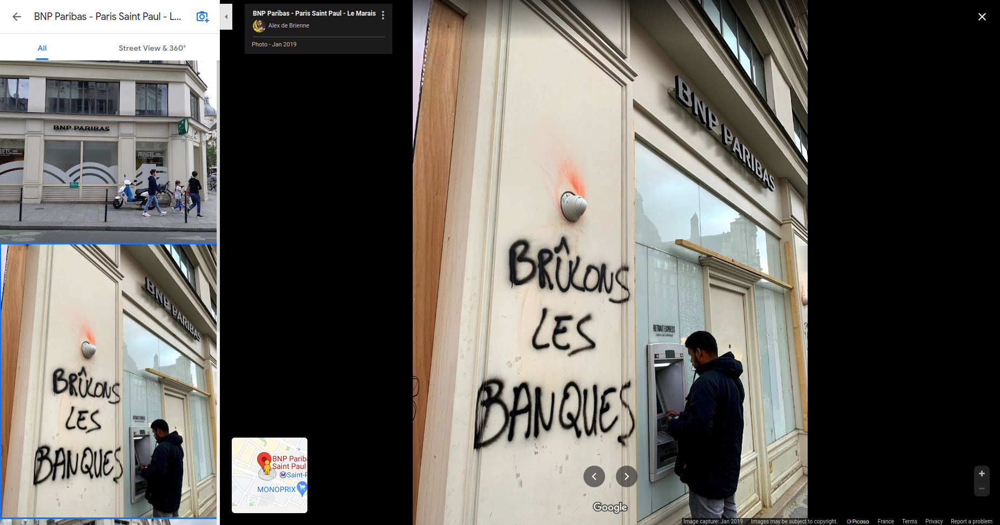
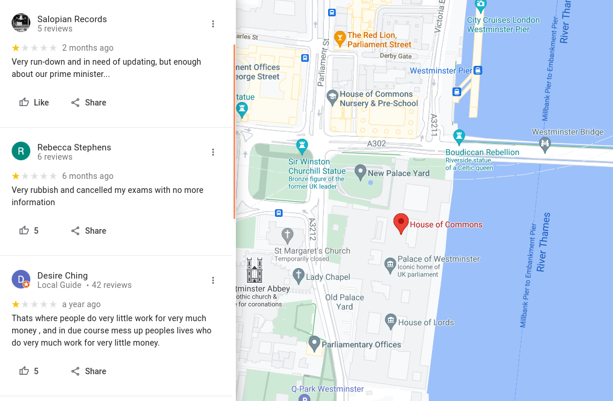
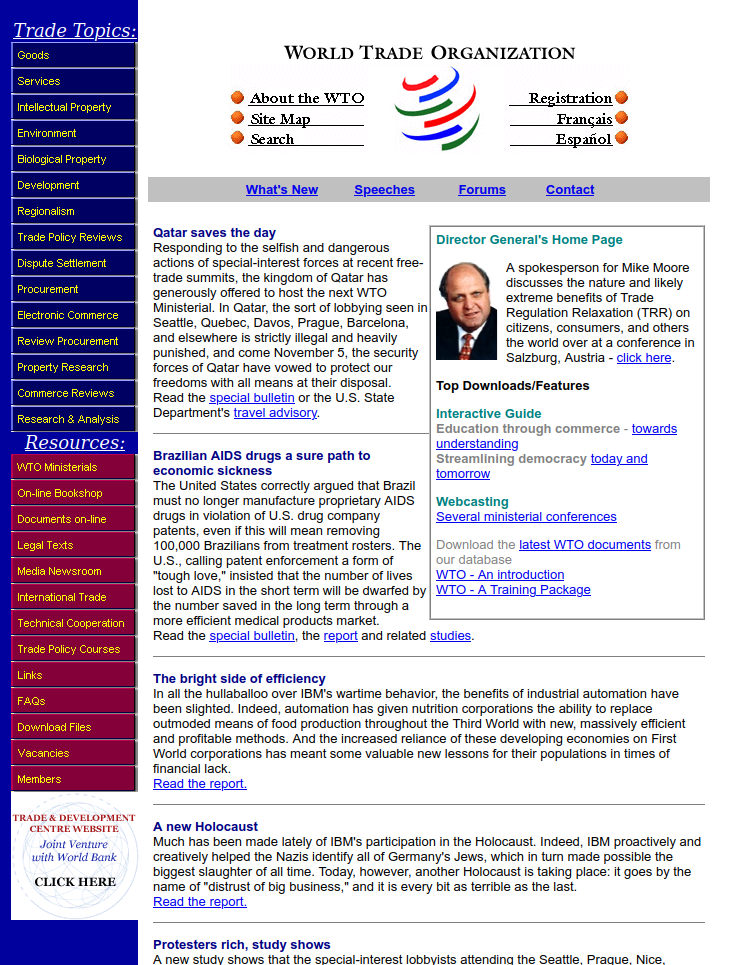
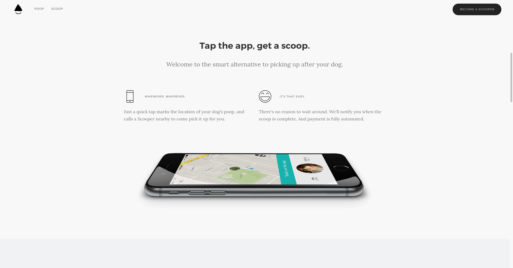

# When Virtual Spaces Are Creatively Hijacked For Political Expression

In the 70's and 80's, while the Internet was still in the works, the first networked communities started emerging. The tech enthusiasts forming them often held a [strong belief in the emancipatory potential](https://fredturner.stanford.edu/wp-content/uploads/turner-tc-counterculture-new-economy.pdf) of communication technologies. They thought that the wild and chaotic virtual spaces that were being opened up, would enable a truly democratic society to emerge. A society premised on radical freedom of expression, everyone having the technological means to speak to everyone else, therefore maximizing individual and collective intelligence.

Eventually the Internet became mainstream, everyone did get the technological means to speak, and the amount of information available exploded. A new bottleneck then appeared : listening, the human brain and the limited amount of information it can process. This marked the rise of the *attention economy*, a new condition in which human *attention* became a scarce resource that corporations such as Facebook and Google started extracting and selling.

The rest of course is history. The prophesied renewal of democracy didn't take place. Instead we saw a corporate takeover of these virtual spaces, resulting in [mass](https://theintercept.com/2019/07/11/china-surveillance-google-ibm-semptian/) censorship, the [commodification of human behaviour at scale](https://www.theguardian.com/news/series/cambridge-analytica-files) and a toxic polarization of public debate. The violent mechanics of the attention economy are slowly [eroding people's agency](https://medium.com/thrive-global/how-technology-hijacks-peoples-minds-from-a-magician-and-google-s-design-ethicist-56d62ef5edf3) and [silencing activists' voices](https://gizmodo.com/facebook-follows-up-vow-to-fight-climate-change-with-ma-1845139884). 

Regardless, and even as [it is being muted](https://about.fb.com/news/2021/02/reducing-political-content-in-news-feed/), political expression overflows at the margins. People break online platforms' rules in any way they can or form communities powerful enough to manipulate the algorithms of social media feeds. The following is a heterogenous compilation of such hijacks. It documents unexpected and creative ways in which individuals or groups reclaim their political agency through the (mis)use of communication technologies. What do these examples tell us ? Do they symbolise early network utopias being alive and well ? Or on the contrary, are they a symptom (yet another) of their deep corruption by private interests ?

## Spam and Other Incongruous Content

Spamming is, [according to media scholar Finn Brunton](https://direct.mit.edu/books/book/3708/SpamA-Shadow-History-of-the-Internet), "the project of leveraging information technology to exploit existing gatherings of attention". Spam infiltrates virtual spaces through every crack available. It appears by surprise on platforms where user content is otherwise heavily policed. Of course, a vast majority of it consists in senseless scam messages. But political expression can sometimes take the form of spam too.

### On Google Maps

If you search on Google Maps for ["BNP, Paris Saint Paul"](https://www.google.com/maps/place/BNP+Paribas+-+Paris+Saint+Paul+-+Le+Marais/@48.8555584,2.3581174,17z/data=!3m1!4b1!4m5!3m4!1s0x47e671fdf0f0dfef:0x66c7c3466c35a223!8m2!3d48.855622!4d2.3603449) and go to the photo section, here's what you'll see : 

For context, BNP is one of the biggest French banks, and in the picture we see one of its branches (Rivoli street, in Paris) with graffiti that translates to "let's burn the banks". 

There's a lot more content on Google maps that would fit in the spam category. This includes political rants, despite the fact that they are explicitly forbidden by the content policy : ["maps is not meant to be a forum for general political, social commentary, or personal rants. Content that does not meet this standard will be removed"](https://support.google.com/contributionpolicy/answer/7400114?hl=en&ref_topic=7422769#zippy=%2Coff-topic). Here's how to easily find some of these : 

- Search for a major political institution in any country (for example the [House of Commons](https://www.google.com/maps/place/House+of+Commons/@51.4999428,-0.126805,17z/data=!4m7!3m6!1s0x487604c300a74337:0xc755a7d3920c4037!8m2!3d51.4999428!4d-0.124611!9m1!1b1), which is the national parliament in the UK)
- Open the "Reviews" section
- Sort by "Lowest rating"

### Staged Protests in Video Games

Spam's pervasiveness shows that any technology, if it has some degree of openness, will be misused. There are, for example, many cases of people hijacking video games to spread a political message. 

"dead in iraq" is a live performance realized by artist Joseph DeLappe in 2006, and an early example of political spam / hijack of an online game. This performance takes place inside ["America's Army"](https://www.americasarmy.com/), the "Official Game of the U.S. Army" and a platform for recruiting new soldiers. DeLappe joins the game as a player and starts enumerating the names of American soldiers who died during the Iraq war using the in-game chat, thus flooding the conversation and angering other players. 

DeLappe's messages serve as an ["online memorial to those military personnel who have been killed", and a "cautionary gesture" to the potential new recruits](http://www.delappe.net/project/dead-in-iraq/).

<!-- EMBED : [https://www.youtube.com/embed/VTnuUMM7frk](https://www.youtube.com/embed/VTnuUMM7frk) -->
<iframe width="560" height="315" src="https://www.youtube.com/embed/VTnuUMM7frk" title="YouTube video player" frameborder="0" allow="accelerometer; autoplay; clipboard-write; encrypted-media; gyroscope; picture-in-picture" allowfullscreen></iframe>

Other times, the game platform is not used directly for spamming, but rather as a set to a virtual protest, which will then be filmed and published on other media. Such performances have had success during the early days of the covid pandemic, when activists were forced to invent new approaches compatible with confinement.

During the Black Lives Matter (BLM) protests in 2020 for example, virtual rallies were held in several video games such as the Sims or Animal Crossing.

Both of these games provide creation tools which enabled designers to craft virtual [BLM-themed](https://www.ebonix.com/) [accessories](https://nooksisland.com/designs?search=black+lives+matter). Activists then equipped their avatars with these accessories and gathered in the same local or online game to enact marches and chants. The virtual protest is screenshot or filmed, and shared on social media in order to raise awareness or funds for the cause.

<!-- EMBED : [https://twitter.com/GUCClSIMS/status/1269819139364962307](https://twitter.com/GUCClSIMS/status/1269819139364962307) -->
<blockquote class="twitter-tweet">
tonight’s vigil in south newcrest <a href="https://twitter.com/hashtag/BLMSimsRally?src=hash&amp;ref_src=twsrc%5Etfw">#BLMSimsRally</a> <a href="https://t.co/iQKhQnkrjS">pic.twitter.com/iQKhQnkrjS</a>
&mdash; 𝖌𝖚𝖈𝖈𝖎 𝖘𝖎𝖒𝖘 (@GUCClSIMS) <a href="https://twitter.com/GUCClSIMS/status/1269819139364962307?ref_src=twsrc%5Etfw">June 8, 2020</a></blockquote> 

<!-- EMBED : [https://t.co/U0IvnZb6ZP](https://t.co/U0IvnZb6ZP) -->
<blockquote class="twitter-tweet">
Thank you for the overwhelming support towards our animal crossing <a href="https://twitter.com/hashtag/BlackLivesMatter?src=hash&amp;ref_src=twsrc%5Etfw">#BlackLivesMatter</a> march and fundraiser. Big 🖤🖤🖤 to ALL who turned out so passionately and especially <a href="https://twitter.com/pingguino?ref_src=twsrc%5Etfw">@pingguino</a> and <a href="https://twitter.com/mpinner?ref_src=twsrc%5Etfw">@mpinner</a> for creative support. <a href="https://twitter.com/hashtag/acnh?src=hash&amp;ref_src=twsrc%5Etfw">#acnh</a> <a href="https://t.co/U0IvnZb6ZP">pic.twitter.com/U0IvnZb6ZP</a>
&mdash; Adelle @ happy juneteenth! (@Adellelin) <a href="https://twitter.com/Adellelin/status/1274886969927983108?ref_src=twsrc%5Etfw">June 22, 2020</a></blockquote> 

### Overcoming Censorship

On virtual platforms which are not originally designed for public discussion, political content is often not expected to be found. This allows some of these platforms to stay below the radar of the state authorities which would normally censor speech. 

In early 2019, the government of Hong Kong [introduced an extradition bill](https://www.nytimes.com/2019/06/10/world/asia/hong-kong-extradition-bill.html) which many feared would make it easier for the Chinese government to arrest Hong Kong political dissidents. This event led to 2 years of pro-democracy protests, with millions of people marching in the streets and increased government repression on the people of Hong Kong. Protesters have then had to innovate in order to stay mobilized and evade police surveillance. [It was for example reported](https://www.scmp.com/abacus/culture/article/3021560/how-hong-kong-protesters-are-using-tinder-and-pokemon-go) that they started to use dating app Tinder or Apple AirDrop to publicly share info on events and marches.

<!-- EMBED : [https://twitter.com/GavinHuang/status/1156988179678785536](https://twitter.com/GavinHuang/status/1156988179678785536) -->
<blockquote class="twitter-tweet">
So it’s come to this—I’m getting protest info on Tinder <a href="https://t.co/bMfRYCJv1T">pic.twitter.com/bMfRYCJv1T</a>
&mdash; Gavin Huang 黄藹禧 (@GavinHuang) <a href="https://twitter.com/GavinHuang/status/1156988179678785536?ref_src=twsrc%5Etfw">August 1, 2019</a></blockquote> 

<!-- EMBED : [https://twitter.com/ziqinglow/status/1157293482383253504](https://twitter.com/ziqinglow/status/1157293482383253504) -->
<blockquote class="twitter-tweet">
Finally got airdropped stuff on the train. Posters calling for a general strike next Monday <a href="https://twitter.com/hashtag/FreedomHK?src=hash&amp;ref_src=twsrc%5Etfw">#FreedomHK</a> <a href="https://t.co/UPTjSLITUY">pic.twitter.com/UPTjSLITUY</a>
&mdash; Zoe Low (@ziqinglow) <a href="https://twitter.com/ziqinglow/status/1157293482383253504?ref_src=twsrc%5Etfw">August 2, 2019</a></blockquote> 

When the Hong Kong demonstrations were slowed down by the pandemic in early 2020, [activists took their political message to Animal Crossing](https://www.wired.co.uk/article/animal-crossing-hong-kong-protests-coronavirus) - just as the BLM protesters did. The video game has granted them a safe virtual space where they can [gather respectfully of social distancing rules](https://www.scmp.com/lifestyle/entertainment/article/3079128/how-nintendos-animal-crossing-became-home-hong-kong).

<!-- EMBED : [https://twitter.com/joshuawongcf/status/1245639425331056640](https://twitter.com/joshuawongcf/status/1245639425331056640) -->
<blockquote class="twitter-tweet">
Animal Crossing is Fast Becoming a New Way for Hong Kong Protesters to Fight for Democracy! The <a href="https://twitter.com/hashtag/Covid_19?src=hash&amp;ref_src=twsrc%5Etfw">#Covid_19</a> pandemic has halted public demonstrations, so protesters are taking their cause to <a href="https://twitter.com/hashtag/AnimalCrossing?src=hash&amp;ref_src=twsrc%5Etfw">#AnimalCrossing</a>.<a href="https://t.co/A599kjlYsV">https://t.co/A599kjlYsV</a>   (This is my island!) <a href="https://t.co/vjBhzw1nUa">pic.twitter.com/vjBhzw1nUa</a>
&mdash; Joshua Wong 黃之鋒 😷 (@joshuawongcf) <a href="https://twitter.com/joshuawongcf/status/1245639425331056640?ref_src=twsrc%5Etfw">April 2, 2020</a></blockquote>  

In 2020, the freedom of press organization [Reporters Without Borders](https://rsf.org/) (RSF) also demonstrated [a fantastic example](https://uncensoredlibrary.com/en) of use of a video game to avoid state censorship. They put up a Minecraft server which any player in the world can connect to. On this server, there is a spectacular neo-classical library building [painstakingly crafted](https://uncensoredlibrary.com/en/v/making-of) using 12.5 millions of blocks, and in this library building, players can find more than 200 books and articles which have been censored in their country of origin.

Although the project is partly symbolic (and a PR stunt), it did effectively enable RSF to smuggle these writings back into the countries from which they were banned.

<!-- EMBED : [https://www.youtube.com/embed/EBI7-pL52GY](https://www.youtube.com/embed/EBI7-pL52GY) -->
<iframe width="560" height="315" src="https://www.youtube.com/embed/EBI7-pL52GY" title="YouTube video player" frameborder="0" allow="accelerometer; autoplay; clipboard-write; encrypted-media; gyroscope; picture-in-picture" allowfullscreen></iframe>

## Fake News and Hoaxes

Fake news has been a much discussed topic in recent years, especially in regard to their impact on public discourse and democracy. Research has found that [fake news spread faster and further](https://science.sciencemag.org/content/359/6380/1146) than real news on social media.

By striking the sweet spot between plausible and preposterous, a well crafted online hoax has the power to summon the same forces that make fake news so efficient at hijacking attention. Tricksters and activists have long used this form of action as a [means to reclaim public attention for various causes](https://ijoc.org/index.php/ijoc/article/view/1286). Contrary to fake news though, hoaxes are [always revealed after the joke played out](https://theyesmen.org/rant/era-fake-news-good-has-rebegun).

### The Yes Men

When talking about online hoaxes and tricks, it is impossible not to mention [the Yes Men](https://theyesmen.org), which started as a two-people project in the late 90's, and has since industrialised the process of producing [fake websites](https://theyesmen.org/hijinks-all?view=fake_websites_embed_block).

In 1999, they realized their first hoax accidentally by setting up a [fake website of the World Trade Organisation](https://gatt.org.theyesmen.org/homewto.html) (WTO). While the page copies the visual identity of the WTO of that time, it is however full of ironic news and anti-capitalist writings. In spite of this, people fell for it. Several business conferences inadvertently booked the Yes Men to give a talk. 

The Yes Men consider the websites that they produce as representing their opponents ["more transparently than they ever present themselves"](https://theyesmen.org/hijinks-all?view=fake_websites_embed_block), therefore "making these true websites, not fake". The message is almost always fact-based, and aims at exposing an organisation and its wrong-doings, usually in order to mobilize support for a broader campaign.

<!-- EMBED : [https://www.youtube.com/embed/40q4cPNXfF0](https://www.youtube.com/embed/40q4cPNXfF0) -->
<iframe width="560" height="315" src="https://www.youtube.com/embed/40q4cPNXfF0" title="YouTube video player" frameborder="0" allow="accelerometer; autoplay; clipboard-write; encrypted-media; gyroscope; picture-in-picture" allowfullscreen></iframe>

### Pooper

At other times, a hoax can also be a form of social commentary, a work of fiction which magnifies some of the absurdities of society.

In 2016, two startup bros announced the release of a new app called [Pooper](http://pooperapp.com/) that was to be the "Uber For Dog Poop". Basically, your dog poops, you fire the app, take a geolocated picture of the poop, and an independent contractor called a "scooper" will then come to clean it.

The news got quickly picked up by the press in the US and beyond, even though some of the journalists were already suspicious about the fact that this was actually a hoax. Regardless, [public interest rose](https://www.newsweek.com/how-media-got-fooled-completely-satirical-dog-poop-app-485598), so much so that hundreds of people signed-up, and real investors contacted the tricksters to see if they could invest in the new app.

A few days later, the creators revealed the joke to be ["an art project that satirizes our app-obsessed world"](https://www.newsweek.com/how-media-got-fooled-completely-satirical-dog-poop-app-485598), and a comment on the inanity and exploitativeness of many of the new businesses operating under the label of the "sharing economy".

<!-- EMBED : [https://www.youtube.com/embed/eC14Ohz5h4Q](https://www.youtube.com/embed/eC14Ohz5h4Q) -->
<iframe width="560" height="315" src="https://www.youtube.com/embed/eC14Ohz5h4Q" title="YouTube video player" frameborder="0" allow="accelerometer; autoplay; clipboard-write; encrypted-media; gyroscope; picture-in-picture" allowfullscreen></iframe>

### The Shed At Dulwich

Oobah Butler is a journalist for VICE, who used to be paid writing fake reviews for restaurants. In 2017, knowing how the mechanics of reviewing websites such as Trip Advisor worked, he decided to try a [little experiment](https://www.vice.com/en/article/434gqw/i-made-my-shed-the-top-rated-restaurant-on-tripadvisor). He would create a page on Trip Advisor for a restaurant that didn't exist, "The Shed At Dulwich", and try to make it the number #1 restaurant in the whole of London. 

After six months of asking his friends to write fake 5-star reviews and ghosting real customers desperate to book a table, he eventually made it to the first place. 

His experiment, a comment on the online reputation economy (stars, likes, follows, ...), proved that Trip Advisor was, in his words, a "false reality". It also illustrates more generally how competition for attention has created a perverse incentive for people to try and manipulate online platforms, therefore turning the Internet into a place where [a lot of things are fake](https://nymag.com/intelligencer/2018/12/how-much-of-the-internet-is-fake.html).  

<!-- EMBED : [https://www.youtube.com/embed/bqPARIKHbN8](https://www.youtube.com/embed/bqPARIKHbN8) -->
<iframe width="560" height="315" src="https://www.youtube.com/embed/bqPARIKHbN8" title="YouTube video player" frameborder="0" allow="accelerometer; autoplay; clipboard-write; encrypted-media; gyroscope; picture-in-picture" allowfullscreen></iframe>

## Strength in Numbers

In the past 20 years, thanks to the participatory web, we have seen the emergence of decentralized communities which can count up to millions of people and span the entire planet. Their members share a common interest or the same virtual hangout, and they often develop a deep and complex culture made up of unique slang, inside jokes and memes.

One of the strengths of these communities is their leaderless nature, which enables the emergence of a form of collective intelligence, where the best ideas spread fast and far. On the other hand, the lack of structure also induces these movements to be chaotic and to rarely have a clear political agenda or a long term strategy.

Belonging to these communities can become an important part of their members' personal identities, sometimes up to a point of collective narcissism. Through the power of the collective, people reclaim their individual agency and assert their existence in the broader media environment.

### Anonymous

"Anonymous" is probably the most famous of these online communities. It is a decentralized and leaderless activist movement known mostly for its cyberattacks. It is multi-faceted, consists of different sensitivities brought together by the joys of trolling, and by a radical position towards defending freedom of speech.

Anonymous originated in the early 2000s, from the inside jokes of the imageboard 4chan, a website where users could post anonymously and by doing so appeared under the username "Anonymous". The name of the movement then came up as a gag : what if all these "Anonymous" users, what if 4chan was actually just one person ? 

It is hard to tell a single, concise story of Anonymous, since it is so complex, oftentimes incoherent. Many posts on 4chan are deeply racist and misogynistic, but on the other hand, Anonymous activists often took direct action against homophobia, racism, and different forms of oppression, ...

In 2010, Anonymous launched "Operation Payback", a series of cyberattacks on various copyrights and [financial organizations](https://www.theguardian.com/world/2010/dec/08/wikileaks-visa-mastercard-operation-payback). They managed to take down several important websites, including Visa, Mastercard and PayPal which subsequently [claimed 3.5 million pounds in damages](https://www.bbc.com/news/uk-20449474).

<!-- EMBED : [https://www.youtube.com/embed/bl2_-NYm6yA](https://www.youtube.com/embed/bl2_-NYm6yA) -->
<iframe width="560" height="315" src="https://www.youtube.com/embed/bl2_-NYm6yA" title="YouTube video player" frameborder="0" allow="accelerometer; autoplay; clipboard-write; encrypted-media; gyroscope; picture-in-picture" allowfullscreen></iframe>

### K-Pop Stans

The obsessive K-Pop fans (also called "K-Pop Stans") is another online community which, with its plurality, its love of memes, and [its own problem with racism](https://www.vox.com/2020/6/22/21295700/k-pop-fan-activism-black-lives-matter-trump-rally-racism-cultural-appropriation-reset-podcast), has often been [compared to Anonymous](https://www.technologyreview.com/2020/06/23/1004336/tiktok-teens-kpop-stans-trump-resistance-its-complicated). The Stans are very active on platforms such as TikTok and Twitter, where they relentlessly share content on their favorite bands. Thanks to their great numbers and their coordination, the K-Pop Stans have collectively become experts at hijacking visibility on social media, in order to promote the artists that they admire, and make them appear at the top of the feeds.

In 2020, in the midst of the Black Lives Matter (BLM) protests in the US, the K-Pop stans suddenly appeared in the limelight on western media. It started with the Stan's effort to invisibilize racist tweets and discussions, through the [flooding of anti-BLM hashtags](https://twitter.com/search?q=(%23WhiteLivesMatter)%20until%3A2020-06-04%20since%3A2020-06-03%20-filter%3Areplies&src=typed_query&f=live) on Twitter. It continued with [crashing the Dallas police app](https://twitter.com/DallasPD/status/1267236088755695618) by spamming it with fancams (close-up videos of their idols). Finally, it culminated in [crashing the party at Trump's first post-covid campaign rally](https://www.nytimes.com/2020/06/21/style/tiktok-trump-rally-tulsa.html). The K-Pop stans had organised a "no-show" protest, by discreetly booking as many free tickets as they could, and then simply not coming to the meeting, leaving many of the seats empty.

<!-- EMBED : [https://twitter.com/Iuv4enha/status/1268329931236347905](https://twitter.com/Iuv4enha/status/1268329931236347905) -->
<blockquote class="twitter-tweet">
hope y’all burn in hell :)) <a href="https://twitter.com/hashtag/BlueLivesMatter?src=hash&amp;ref_src=twsrc%5Etfw">#BlueLivesMatter</a> <a href="https://twitter.com/hashtag/WhiteLivesMatter?src=hash&amp;ref_src=twsrc%5Etfw">#WhiteLivesMatter</a> <a href="https://t.co/J92Gy5P2gO">pic.twitter.com/J92Gy5P2gO</a>
&mdash; jun ☕️ SUNOO MONTH (@Iuv4enha) <a href="https://twitter.com/Iuv4enha/status/1268329931236347905?ref_src=twsrc%5Etfw">June 3, 2020</a></blockquote> 

<!-- EMBED : [https://twitter.com/dreamy_pjm/status/1268330081577054208](https://twitter.com/dreamy_pjm/status/1268330081577054208) -->
<blockquote class="twitter-tweet">
Instead of being a racist asshole you should Stan BLACKPINK <a href="https://twitter.com/hashtag/WhiteLivesMatter?src=hash&amp;ref_src=twsrc%5Etfw">#WhiteLivesMatter</a> <a href="https://t.co/JE3Bz60RO9">pic.twitter.com/JE3Bz60RO9</a>
&mdash; Samantha ⁷ (@dreamy_pjm) <a href="https://twitter.com/dreamy_pjm/status/1268330081577054208?ref_src=twsrc%5Etfw">June 3, 2020</a></blockquote> 

<!-- EMBED : [https://twitter.com/DallasPD/status/1267236088755695618](https://twitter.com/DallasPD/status/1267236088755695618) -->
<blockquote class="twitter-tweet">
Due to technical difficulties iWatch Dallas app will be down temporarily. <a href="https://t.co/zksA1hkVhV">pic.twitter.com/zksA1hkVhV</a>
&mdash; Dallas Police Dept (@DallasPD) <a href="https://twitter.com/DallasPD/status/1267236088755695618?ref_src=twsrc%5Etfw">May 31, 2020</a></blockquote> 

### WallStreetBets

In January 2021, a subreddit called [WallStreetBets](https://new.reddit.com/r/wallstreetbets/top/?t=all) (WSB) came to public attention when it managed to cause [billions of dollars in losses](https://www.ft.com/content/397bdbe9-f257-4ca6-b600-1756804517b6) to some prominent Wall Street hedge funds.

WSB is a community that has existed since 2012, has now more than 10 million members and presents itself as "Like 4chan found a Bloomberg Terminal". Its members like to call themselves "Degenerates", "Autists", ["Apes"](https://www.gizmodo.com.au/2021/03/wallstreetsbets-is-sending-gorilla-conservation-to-the-moon/) or "Retards" (sic), because their main activity (besides sharing memes) is betting on the stock market against conventional wisdom, on companies that no one believes in. They pick a target, release memes and jokes about it, encouraging the whole community to follow the movement and buy altogether a big amount of shares to artificially inflate the price. When this happens, it causes [hedge funds that had placed a bet on that company going down](https://www.ft.com/content/3f6b47f9-70c7-4839-8bb4-6a62f1bd39e0) to lose a lot of money.

WSB came out of the trolling culture of Anonymous, as well as a desire of small traders to stick it to big finance. Of course, just like in other large online communities, members are a varied bunch. Here again, misogynistic jokes abound, and people's motivations for taking part vary greatly. While [some are seeking justice](https://new.reddit.com/r/wallstreetbets/comments/l6omry/an_open_letter_to_melvin_capital_cnbc_boomers_and/) against Wall Street, others are clearly in it just for financial gains.

EMBED : [https://www.redditmedia.com/r/wallstreetbets/comments/fxwjvr/attention_if_you_produce_anything_of_value_fuck](https://www.redditmedia.com/r/wallstreetbets/comments/fxwjvr/attention_if_you_produce_anything_of_value_fuck)
<!-- <iframe id="reddit-embed" src="https://www.redditmedia.com/r/wallstreetbets/comments/fxwjvr/attention_if_you_produce_anything_of_value_fuck/?ref_source=embed&amp;ref=share&amp;embed=true" sandbox="allow-scripts allow-same-origin allow-popups" style="border: none;" scrolling="no" width="640" height="524"></iframe> -->

EMBED : [https://www.redditmedia.com/r/wallstreetbets/comments/l7feld/its_power_to_the_traders_now](https://www.redditmedia.com/r/wallstreetbets/comments/l7feld/its_power_to_the_traders_now)
<!-- <iframe id="reddit-embed" src="https://www.redditmedia.com/r/wallstreetbets/comments/l7feld/its_power_to_the_traders_now/?ref_source=embed&amp;ref=share&amp;embed=true" sandbox="allow-scripts allow-same-origin allow-popups" style="border: none;" scrolling="no" width="640" height="419"></iframe> -->

<!-- EMBED : [https://www.redditmedia.com/r/wallstreetbets/comments/l79jko/im_so_proud_of_you_all](https://www.redditmedia.com/r/wallstreetbets/comments/l79jko/im_so_proud_of_you_all) -->
<iframe id="reddit-embed" src="https://www.redditmedia.com/r/wallstreetbets/comments/l79jko/im_so_proud_of_you_all/?ref_source=embed&amp;ref=share&amp;embed=true" sandbox="allow-scripts allow-same-origin allow-popups" style="border: none;" scrolling="no" width="640" height="490"></iframe>

As subversive as WallStreetBets may seem, the world of finance immediately saw an opportunity to make money. A Wall Street fund started considering [hiring reddit users to help them cash in](https://www.gizmodo.com.au/2021/02/wall-street-fund-wants-to-hire-r-wallstreetbets-users-to-help-pick-meme-stocks/), while the official NASDAQ website started posting [trading tips](https://www.nasdaq.com/articles/meme-stocks-list%3A-the-top-10-reddit-stocks-seeing-chatter-in-the-june-2021-rally-2021-06) on what is now being called "meme stocks".

## So What?

What to think, then, of spam, fake news and mobs being weaponized in a race forward to steal attention and bypass control from corporate giants ? 

As a diligent observer of tech phenomena, I often get the same ambivalent feeling. Fascination with the possibles, with the teeming individual and social creativity in the realm of technology. Pessimism about how these creations invariably end up feeding the nefarious mechanisms of late capitalist society. 

With these hijacks, I feel that conflict again. I am on one hand truly impressed by the ingenuity people display to get their voices heard. On the other hand, it seems to me that this ingenuity mostly stands as a survival strategy, in a harsh competition for attention that pits everyone against everyone else.

By writing "the medium is the message", media theorist Marshall Mc Luhan urged us to consider that the way a message is delivered has more cultural significance than the content of the message itself. What does *hijacking* as a medium for political expression then tells us ? Maybe, it marks how broken public debate is, how far away we've drifted from the utopian vision of a democratic society supercharged by communication technologies.